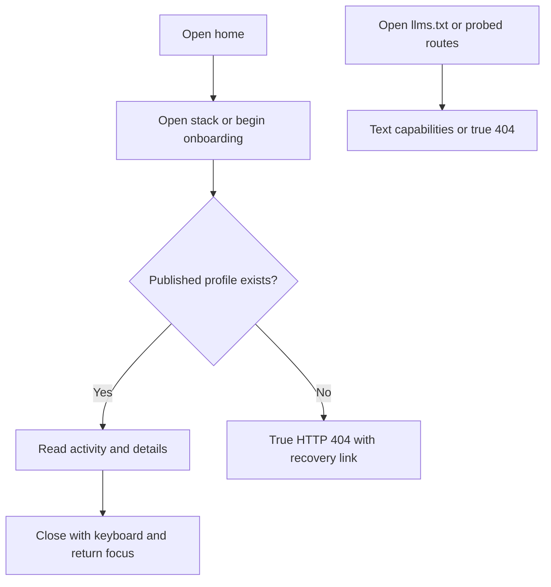
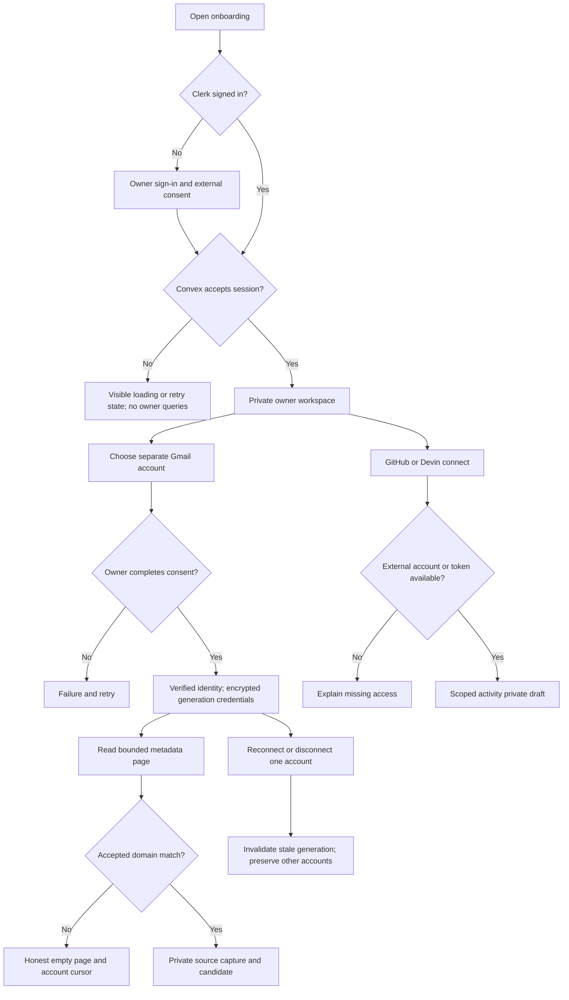
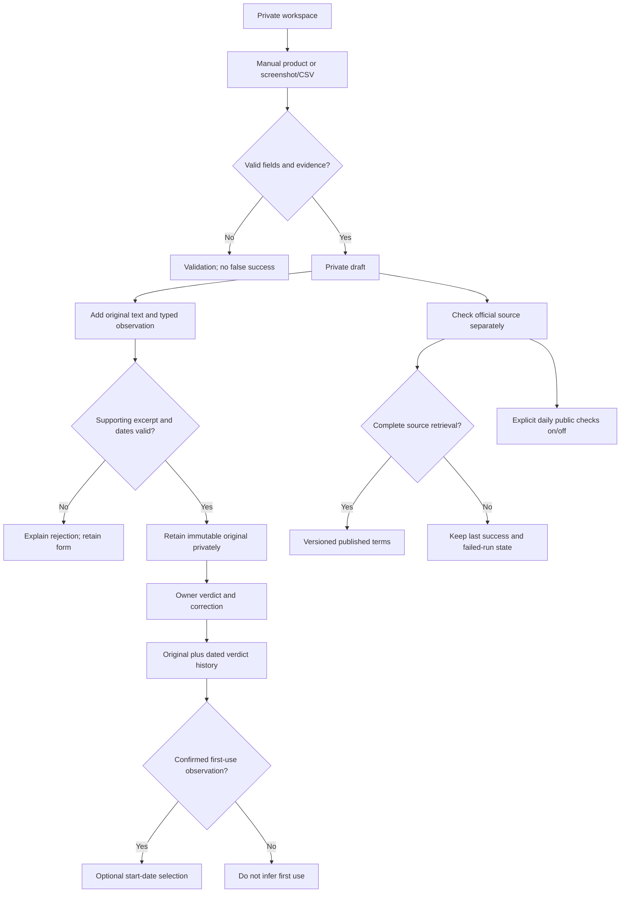
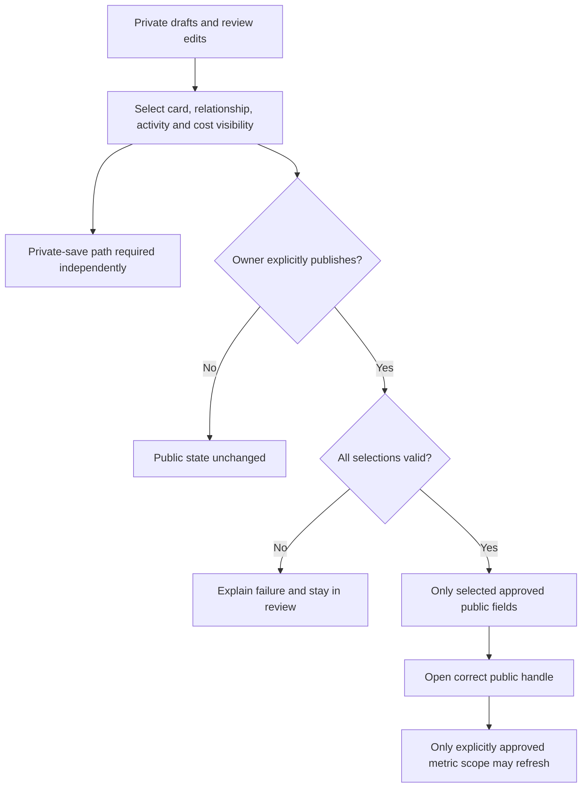
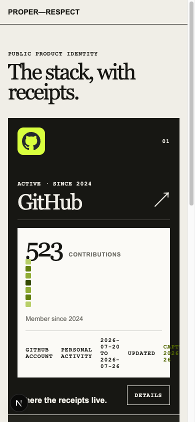
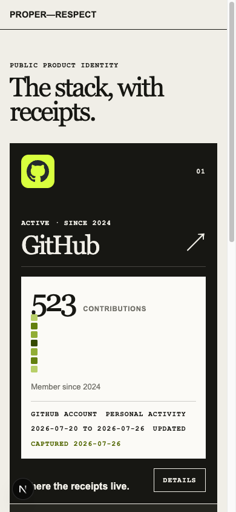

# Dogfood Report — codex/proper-respect-self-test-20260916

> Diff-scoped browser QA versus local `main`, September 17, 2026. Start HEAD `12d07c9b96d0fd59a2faf520d99db6b6632eda2c`; merge base `8be53847b083efeace0ebe287c99b557ac4d9810`. No push or deployment authorized by this run.

## Diff Summary

- 117 files differ: owner authentication, private discovery/review, product information and activity cards, mailbox lifecycle and Gmail routes, public routing/discovery resources, and regression coverage.
- Existing owner checkout stays on its branch. Unrelated `.DS_Store` and cadence ideation HTML are excluded and hash-protected.
- No evidence or synthetic fixtures may be published by QA. Existing fixture rendering, if used, proves UI behavior only and stays separate from the real Gmail gate.

## Personas

- **Owner reconstructing a technology history** — wants useful discoveries before profile decoration, source/period clarity, and private control — inferred from `docs/000-current-product-thesis.md` and the owner's September 17 direction.
- **Person inspecting a shared stack** — wants compact recognizable cards, understandable metrics and accessible supporting detail — same sources.
- No STRATEGY/PRODUCT/VISION/PERSONAS files or declared Compound Packs. Resolver returned empty roots with no warnings/errors.

## Flows Tested

### Public visitor

### Owner authentication and source connections

### Private evidence and product review

### Owner-controlled publication

## Test Matrix & Results

| # | Flow | Journey / Scenario | Status | Issue | Fix | Commit |
|---|------|--------------------|--------|-------|-----|--------|
| 1 | Public | Home entry, links and empty/unpublished reference profile | Pass | Home links correctly reach unpublished-profile 404; reference CTA is an owner-facing dead end until publication. | — | — |
| 2 | Public | Missing single/nested profiles, llms.txt and false capability routes | Pass | Browser fetch: llms.txt 200 text/plain; missing/nested/probed routes and disabled fixture 404. | — | — |
| 3 | Auth | Signed-out onboarding to sign-in modal; keyboard and mobile | Pass | Real sign-in modal opened; OAuth leg awaits owner. | — | — |
| 4 | Auth | Existing real owner session to Convex private workspace; reload | Blocked (needs human verify) | Agent-browser cannot attach to existing browser; dedicated Chrome for Testing awaits owner sign-in. Requested asynchronously. | — | — |
| 5 | Identity | Handle form validation and successful identity/private persistence | Blocked (needs human verify) | Authenticated identity validation/save/reload requires the pending owner session; no handle was changed. | — | — |
| 6 | Gmail | Account labels, separate lifecycle, bounded-read and empty feedback | Blocked (needs human verify) | Fresh account-label/read UI awaits owner session. Signed-out start/read routes return401; prior live receipts remain historical. | — | — |
| 7 | Gmail | Real consent/callback, matching page to capture/candidate and cursor | Blocked (needs human verify) | No fresh consent/provider read attempted. Real recognized-product capture/candidate proof remains open; owner sign-in is the first current gate. | — | — |
| 8 | Gmail | Reconnect/disconnect invalidates stale generation without cross-account loss | Skipped | No real grant was disconnected or generation changed for QA. Deterministic lifecycle coverage passes; historical live proof stays separate. | — | — |
| 9 | Connectors | GitHub missing-link guidance and real import; Devin required/token path | Skipped | No new GitHub/Devin account or token was connected in this pass. Source flow mapped; current owner UI awaits sign-in. | — | — |
| 10 | Intake | Manual product required fields and private draft persistence | Blocked (needs human verify) | Real manual draft creation and reload await owner sign-in; no synthetic records were inserted into development. | — | — |
| 11 | Intake | Upload validation and private file retention; deletion boundary | Blocked (needs human verify) | Real upload/deletion walkthrough awaits owner sign-in; upload-to-proof linkage is a source-derived concern below. | — | — |
| 12 | Evidence | Original text, exact excerpt, usage/subscription/payment validation | Pass | Isolated synthetic component replay: mismatched excerpt rejected; usage/subscription/payment accepted separately; unknown dates/currency preserved. Real persistence remains blocked at 4/10. | — | — |
| 13 | Evidence | Owner verdict history, corrected first-use selection and publication lock | Blocked (needs human verify) | Synthetic publication lock disables observed-date action and unlocks afterward; real owner verdict/history awaits authenticated session. | — | — |
| 14 | Knowledge | Official terms, failed retrieval preservation, history and watch controls | Pass | Synthetic browser presentation preserves prior terms after failed retrieval and toggles recurring-check copy. Live fetch/history persistence was not invoked. | — | — |
| 15 | Publication | Private save, selected cards/activity/cost and exact public destination | Blocked (human decision) | Private relationship-save/card integration remains Task4; full-shell A/B choice is open. No public mutation was performed to clear QA. | — | — |
| 16 | Cards | Existing activity views, provenance, dialog keyboard/focus, mobile rendering | Fixed | Mobile metadata clipped; supporting units omitted; missing dates implied IN USE. | Wrap source metadata; retain supplied units; omit unsupported date suffix. Mobile 320/390 and desktop1440 replay passed; Escape restores focus. | 7b45d94db5341ae4d9ca9c44ae4912bccf6862e7 |
| 17 | Experience | Desktop/mobile layout, empty guidance and accessible controls | Pass | Public/fixture layouts fit 320/390/1440; details keyboard/focus passed. Authenticated owner layout still blocked at 4. | — | — |
| 18 | Suite | Full npm test once; typecheck/lint and relevant browser regression replay | Pass | npm test:206 Vitest + 5 Node; lint, typecheck, optimized build pass. Agent-browser replay replaces Playwright browser execution in this skill. | — | — |
| 19 | Cards | timeSeries complete browser journey | Skipped | Not present in the two existing browser reference cards. No real activity for this kind was imported; coding supporting-unit rendering has focused SSR coverage. | — | — |
| 20 | Cards | artifactCollection complete browser journey | Skipped | Not present in the two existing browser reference cards. No real activity for this kind was imported; coding supporting-unit rendering has focused SSR coverage. | — | — |
| 21 | Cards | reviewActivity complete browser journey | Skipped | Not present in the two existing browser reference cards. No real activity for this kind was imported; coding supporting-unit rendering has focused SSR coverage. | — | — |
| 22 | Cards | codingActivity complete browser journey | Skipped | Not present in the two existing browser reference cards. No real activity for this kind was imported; coding supporting-unit rendering has focused SSR coverage. | — | — |

## Pack Compliance

None; no declared packs.

## What Was Fixed

### Keep card context readable — `7b45d94db5341ae4d9ca9c44ae4912bccf6862e7`

- **Symptom:** at 390px, source/capture metadata overflowed its 272.625px container to 338/377px and was clipped. Supporting WPM/days units disappeared. Missing start dates emitted an unsupported `IN USE` suffix even for TESTING/ARCHIVED relationships.
- **Root cause:** `.activity-meta` used an unwrapped flex row; supporting metric templates rendered only labels; missing dates shared a usage fallback.
- **Fix:** `app/globals.css` wraps metadata; `components/product-card.tsx` retains supplied units and omits an unknown date suffix. Existing card/dialog design and domain schemas are unchanged.
- **Regression:** `src/client/product-card.test.ts`: before implementation 5 failed / 3 passed; after implementation 8 passed. Browser replay at 320/390/1440px keeps all metadata inside cards; at 390px both metadata client/scroll widths are 273px. Escape closes the dialog and returns focus to Details. Pure CSS containment is checked in the real browser rather than a hollow style-text assertion.
- **Scope:** screenshots use the repository's existing **synthetic reference profile**, not newly imported owner activity. No screenshot data was persisted or published to Convex.

| Before | After |
|---|---|
|  |  |

## Paper Cuts (by persona)

- **Owner reconstructing history — high, open Task4:** current builder leads with handle/bio and an extensive form. A coherent private save/reload/card preview is still missing; it cannot be repaired by styling this page alone.
- **Owner reconstructing history — high, open Task2:** five unfiltered metadata messages per click is a transport proof, not useful history discovery. No catalog match does not establish no products. Add one scoped search with independent query/cursor identity before bounded historical backfill; never relax evidence meaning to force a result.
- **Person inspecting a stack — fixed:** clipped source/period text and missing units obscured evidence meaning on mobile.
- **Person inspecting a stack — medium, open Task4:** tall generic cards and a details dialog remain. The accepted compact branded flip and supporting history need their own coherent implementation.
- **New visitor — medium:** the development home link to Keegan's public stack reaches a correct404 because no profile is published in this development environment. It is not ready as a live demonstration.

## Console Errors

No page errors from `agent-browser errors` in public or fixture sessions. Expected 404 and unauthenticated 401 responses are recorded separately. A test harness attempt to share the live Next directory was rejected by its dev lock; a temporary source snapshot with symlinked dependencies then required webpack because Turbopack rejected the external symlink. Neither harness failure changed application source or the owner server. CLI URL-wait polling was canceled after the target had visibly rendered; later assertions used snapshots/DOM reads.

## Human Verifications

Prior live owner-auth, two-account consent and bounded-read receipts remain valid historical records; no new provider read or consent occurred. `agent-browser` could not attach to the previously used browser. A separate headed test browser reached the real Clerk sign-in modal and an asynchronous request asked the owner to choose Google and sign in. No successful owner session was confirmed before finalization. The browser was subsequently used for unrelated navigation; QA did not interact with that content or close its window.

Next human operation: return to `http://localhost:3000/onboarding` in that test browser, choose **Sign in or create account → Google**, and complete sign-in using the existing owner account. This is owner authentication, not a new mailbox authorization or a request to publish. `ce-dogfood` requires external OAuth legs to remain `Blocked (needs human verify)` until confirmed.

## Decisions for a Human

### Full onboarding-shell choice remains open

- **Incomplete:** the final connection/review shell and independent private relationship-save experience are not integrated.
- **Why not auto-fixed:** replacing the form and public/private save behavior spans the accepted Task4 integration and its Task3 A/B choice. A dogfood patch must not choose that shell or introduce a new evidence model.
- **Options:** select either delivered prototype when integrating the complete shell; meanwhile implement the already-accepted real Wispr intake/private-card component independently.
- **Recommendation:** keep that component moving within Task4. No new architecture review or renewed approval of the accepted card intent is required.

### Source-derived implementation follow-ups — not browser-confirmed failures

These belong to existing Task4 verification and must be reproduced with focused regressions before a fix or a readiness claim. They are not reasons to restart Tasks 1–4.

- `convex/onboarding.ts` creates metric subscriptions only when autoRefresh is true; the mapped path does not revoke them when approval is cleared. `convex/connectors.ts` may later reapply activity. Verify consent withdrawal before exposing refresh as owner-controlled.
- `retainUpload` creates raw/draft records but no proof link, while `privateEvidence.listForProp` follows proof links. Verify that the uploaded original can actually be inspected from its card.
- `evidence-fixture` is not reserved by the handle validator, while a static route occupies that path. Verify/reserve the collision before permitting that public handle.

No backend fix or deployment was made during this browser/display slice.

## Learnings

The mailbox adapter reads only From/Subject/Date metadata, capped at five messages; product resolution uses sender domains from fifteen catalog entries, thirteen with domains. Unknown/unsupported From values are dropped before ingestion and not retained as rejection reasons. Therefore the exact cause of each rejected live message cannot be reconstructed. An empty page advances its account cursor but says nothing about complete source coverage. See `src/server/mailbox-gmail.ts`, `src/domain/discovery.ts`, and the live-proof record.

Parallel execution worked with disjoint ownership: read-only Gmail diagnosis, read-only data-flow mapping, `docs/DEVELOPMENT.md`, and the narrow card fix. The coordinator owned browser interaction, integration, Ref and commits. Compound Engineering remains the workflow; pstack and Matt Pocock skills are selected tactics as described in the guide.

### Pack candidates

No pack exists. A potential future criterion is that metric units, periods, source labels and freshness remain readable at narrow widths. It has not been written into a pack or memory; the local regression/report preserves this run's finding.

## Final Status

**Not ready to present as a completed live product.** The small card correctness fix is locally verified and committed. Real private-card persistence, authenticated review and Gmail match/capture/candidate proof remain unverified in this run; the requested native flip/history integration remains open. No push, backend synchronization, public publication or synthetic seed occurred.

Matrix: 1 Blocked (human decision), 7 Blocked (needs human verify), 1 Fixed, 7 Pass, 6 Skipped. No Pending scenario remains. Blocked scenarios are terminal for this run and are not silently re-queued.

Checks at the fix checkpoint:

- `npm test`: 206 Vitest tests across 24 files + 5 Node tests pass; one full-suite run.
- `npm run lint` and `npm run typecheck`:pass.
- `npm run build`:optimized Next build and TypeScript pass.
- Focused card regression: 5 failures before the fix; 8 pass afterward.
- Browser: actual localhost:3000 home/auth/HTTP boundaries; source-snapshot localhost:3001 synthetic reference/evidence components;320/390/1440 card containment and keyboard replay. No live-data result is inferred from those fixtures.
- `npm run test:e2e` was not invoked because this skill requires browser driving through the direct `agent-browser` CLI. Its existing server-reuse setting can also reuse a nonfixture owner server, so fixture identity must be explicit.

The approved owner runtime remains on localhost:3000 with development `utmost-mongoose-374`; no environment values were changed or copied into the isolated UI harness. That harness used tracked source at the starting SHA plus hash-matched card/CSS fixes, no credentials, no backend, and the repository's existing fixture flag. The temporary harness is stopped after QA. User-owned browser tabs and the owner server remain untouched.
