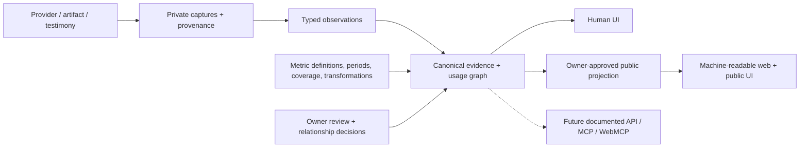

# Multiple mailboxes and native product cards

> **Status correction — 2026-09-20:** Tasks 1–4 and their checkpoints remain preserved. Earlier zero-match, unimplemented intake and development-sync gates below are historical; the September private collection/discovery source has landed. Remaining acceptance is #24; A/B remains unselected and nonblocking. See [release gaps #24](https://github.com/keeganmoody33/PROPER-RESPECT/issues/24) and the [Phase 0/Devin receipt](../verification/2026-09-20-devin-triage-and-phase0-closure.md).

Contract dated September 16, 2026; implementation status and owner product direction corrected September 18. The [canonical Updated Proper Respect Ref](https://plan.ref.tools/oUl8LCIQb32SAicK) holds current execution guidance; the [delivery record](../verification/2026-09-17-product-delivery-state.md) distinguishes committed code, live proof, retained private sources and unfinished integration. The [six original browser comments](../feedback/2026-09-16-onboarding-browser-comments.md) remain verbatim below.

Owner correction, September 18:

> “Here is what I have used and tested, what I am testing right now, my go-to stack, and my track record of how important these things are to what I do.”

Relationships over time organize the experience. Go-to is explicitly owner-selected, independent of frequency. Confirm, save privately, change, archive and resume without erasing history; explanations/work samples are optional and existing evidence is reused. Current/testing/past/go-to views may overlap. No universal score, automatic ranking or inferred abandonment from missing evidence. Personal release also requires one authorized hosted refresh path with visible recoverable failures. Historical completeness, A/B shell choice, optional CE configuration and production Composio adoption do not block independent inventory work. See [current acceptance](../000-current-product-thesis.md#personal-release-acceptance).

The technical product core is an evidence-backed representation of an individual's relationship with technology. Canonical evidence and usage data support multiple interfaces. Preserve tools used/tried/retained, change over time, measurable activity, metric definitions, measurement periods, source coverage/completeness, lineage, transformations/version, freshness, actor when known, capture provenance, and observed/derived/owner-asserted/unresolved status. Graphs render these facts; they do not define them. Affiliate links, introducer attribution, job applications and portfolio presentation are supporting possibilities.

The product flow remains: authorize sources, inspect private discoveries and actual usage, review uncertainty, save privately, then explicitly approve public output. Gmail is one discovery source. The September 17 owner direction prioritizes functional evidence-backed product cards using existing sources; the remaining Gmail candidate proof is specific to that connector. Tasks 1–4 and the canonical domain remain unchanged.

Current owner instruction, verbatim:

> canonical evidence + usage graph -> multiple interfaces

Ora is an external technical diagnostic. Direct public GET verification on September 16 local time confirmed /llms.txt and /robots.txt return 200 text/html through /[handle], and a random missing single-segment route also returns 200. /developers, /sandbox and /mcp display “Profile not found — PROPER—RESPECT”; these are false capability detections, not actual developer/sandbox/MCP surfaces. /openapi.json likewise resolves to HTML. The response body for ?mode=agent is byte-identical to /. Source inspection found only the existing POST GitHub connection route, not a documented general API/OpenAPI/MCP/WebMCP interface. The first independent technical slice is correct missing-profile HTTP semantics and genuine text discovery resources with accurate current capabilities. It must not touch the Task 1/2 ingestion, schema or lifecycle files. API and agent adapters remain deferred; registry/payment/skills/Wikipedia-style checks do not become requirements. This clarification does not renumber Tasks 1–4 or reopen the architecture.

## Product copy to prototype

**Connect your tools. Give your experience its proper respect.**

Bring together the tools you use, the ones you've tried, and the people who put you on. Start with your email accounts; we'll prepare your stack for you to review.

This is proposed copy for the completed connection flow, not copy to ship above an unavailable email connector. The live page must continue to describe actual availability until OAuth and discovery are working.

## The first useful flow

| Moment | What the person sees and does | What the system does |
|---|---|---|
| Start | Sign in; no required bio or public handle form before discovery | Create a private owner record independent of imported mailbox identity |
| Connect | Gmail / Google Workspace and Microsoft / Outlook are the initial provider targets. “Add another account” remains available, including a second account with the same provider | Separately authorize each mailbox for read access; display its account label and granted access. Do not substitute Google identity login |
| Discover | Show account-specific progress, partial results, and failures; let the person continue while another account is unavailable | Prepare private product candidates from attributable evidence. Deduplicate product candidates while retaining every source |
| Review | Show a branded product/activity preview, supported observations, and a small set of unresolved questions | Keep signup, payment, use, inferred candidates, and owner testimony distinct. A marketing message alone never establishes adoption |
| Credit | Add who introduced a product, their source/profile link, and the chosen affiliate/referral destination | Store introducer credit separately from product identity and link destination; never auto-confirm another person's identity or endorsement |
| Save privately | Confirm a discovery, choose current/testing/past, explicitly designate go-to, add optional context | Append the owner decision, preserve evidence/history and leave public state unchanged |
| Publish | Choose which saved relationships, supporting activity and costs to make public | Publish only explicitly selected saved versions; unrelated private edits remain private |
| Return | See what changed, how old the evidence is, and accounts needing attention | Use per-source refresh cadence. New products and new scopes return to private review; stale evidence does not automatically archive a tool |

Manual entry and uploads remain available behind a secondary “Add something missing” path. Existing discovered cards should not require retyping source metrics or dates. The visual prototypes should compare a short guided sequence with a persistent connection-and-preview workspace.

## Each account has its own lifecycle

A personal PROPER-RESPECT identity can own multiple mailbox connections. Use verified provider account identity, not the displayed email address, as the stable key. Display labels and addresses can change. Consent, encrypted credential storage, scan cursor, last success, reauthorization state, and disconnect must each be account-specific.

Disconnect stops future reads for that account and invalidates in-flight work before persistence. It must not disconnect another mailbox or erase reviewed product history. Prefer archive as the ordinary owner action for retained evidence, while keeping actual deletion available as a separate explicit operation. Archiving evidence, archiving a product relationship, disconnecting a source, hiding public content, and deleting retained bytes are distinct decisions. Define their effects on public output and the deletion cascade before release. Provider-side loss of access marks that account unavailable and shows the last successful observation date.

September 16 owner comment, retained verbatim:

> "delete retained evidence" will most likely just be archived by the user instead . Still have options though.

Workplace departure must not strand the person's profile. Support a verified personal sign-in/recovery method independent of the work mailbox. Preserve selected evidence and reviewed claims within the disclosed retention choice; do not promise that a revoked work account can be recovered or that new evidence can be fetched after revocation. Raw mailbox contents stay private; publication is a separate owner choice.

Historical imports without account identity remain labeled legacy/unknown account. Do not retroactively assign them to a newly connected mailbox.

## Provider contracts verified September 16

- Google's [Gmail scopes](https://developers.google.com/workspace/gmail/api/auth/scopes) list `gmail.readonly` for message access and `gmail.metadata` for headers without bodies. Gmail read-only is restricted; public release has provider verification/assessment requirements. This is a concrete connector release dependency.
- Google's [web-server OAuth guide](https://developers.google.com/identity/protocols/oauth2/web-server) supports an account chooser and separately explains granted scopes and CSRF state. A production callback needs owner-bound, expiring, one-use state, PKCE as supported, fixed redirect URLs, and grant validation.
- Microsoft's [Mail.Read delegated permission](https://learn.microsoft.com/en-us/graph/permissions-reference#mailread) applies to the signed-in mailbox. Choose delegated access for each selected account, not organization-wide application access. Tenant restrictions and expired consent are per-account states.
- No send/compose/modify/delete permissions belong in this discovery flow. Recurring refresh requires explicit offline access and account-level disconnect handling.

These references establish available provider capabilities, not configured application credentials or successful connections in PROPER-RESPECT.

## Product brands inside a PROPER-RESPECT frame

Comment 3's requirement is literal:

> Proper Respect will just be what lies outside of these product cards.

GitHub's card should use official Primer primitives, Octicons, typography, calendar spacing, contribution colors, and theme support. Context7 resolved `/websites/primer_style` and returned [Primer primitives](https://primer.style/product/primitives) and the [contribution graph token reference](https://primer.style/primitives/storybook/iframe.html?globals=&id=color-patterns--contribution-graph). Scope provider styles to their card; keep the surrounding connection/review controls in the PROPER-RESPECT system.

The current GitHub collector supplies a contribution calendar and account-creation date. Contributions must remain labeled contributions; they are not a push count or an event feed. Additional native-looking sections require corresponding source data. Empty sections should state what is unavailable instead of displaying synthetic activity as real.

Use verified official references, supplied product screenshots, and Context.dev brand data for other products. Context7 remains a documentation source. [Context.dev's brand API](https://docs.context.dev/guides/get-brand-data) supplies a brand profile; its [MCP documentation](https://docs.context.dev/install-mcp) describes an agent integration route. Keep source/date records and handle missing assets. Brand data is neither personal usage evidence nor proof that a reconstructed chart is vendor-issued. Wispr's supplied images remain private evidence and visual references.

September 16 owner comment, retained verbatim:

> context.dev can provide this for us and is available to connect via plugin or mcp or api.
>
> https://docs.context.dev/guides/get-brand-data

Task 4 targets compact holographic cards with each product's own visual identity. The front shows the product and owner-defined relationship/context, with activity as support; a reversible, keyboard-accessible flip reveals definitions, periods, coverage and lineage. Append-only relationship history remains inspectable in the private collection. First focus: the retained Wispr Insights evidence, then GitHub, Codex and Cursor. Missing timelines stay missing. Context7 supplies official implementation guidance and Context.dev supplies brand assets where configured. An optional owner explanation or selected work-sample/workflow link accompanies the private relationship now. Rich media galleries, backlinks and elaborate evaluations remain later refinements.

September 16 owner comment, retained verbatim:

> Proper Respect will or can orchestrate and arrange said presentation and, probably, if you know the correct amount of lineage or available data, can conduct usage evals of what you've been doing, because some things don't, which would be sick, right?
>
> I want these product cards to have sick-ass graphs, visuals, and very informative things that are very, very advanced, and then you can click on it and flip the card. The person could write about something if they wanted to, if they had a whole bunch of looms that focused on a specific tool, etc., things like that, a piece of content that mentioned it, backlinks, stuff like that.

Introducer credit, affiliate disclosure/destination, relationship history, measurement period, and evidence freshness surround or accompany the native activity surface without pretending to be vendor-issued content.

# Task 1: ✅ Preserve distinct source accounts

Repair evidence ingestion so two mailboxes remain separate sources while contributing to one private product draft. **Status: verified local checkpoint committed; not pushed or deployed.**

:::collapse
## Files — 8 files
:::
- [schema.ts](/Users/keeganmoody/Downloads/PROPER-RESPECT-self-test-20260916/convex/schema.ts) — optional stable source key and source-record identity.
- [discovery.ts](/Users/keeganmoody/Downloads/PROPER-RESPECT-self-test-20260916/convex/discovery.ts) — account-scoped lookup and deduplication, immutable collision checks, legacy replay preservation.
- [connectors.ts](/Users/keeganmoody/Downloads/PROPER-RESPECT-self-test-20260916/convex/connectors.ts) — existing GitHub source lookup remains in its legacy namespace.
- [onboarding.ts](/Users/keeganmoody/Downloads/PROPER-RESPECT-self-test-20260916/convex/onboarding.ts) — manual uploads retain their own legacy source bucket.
- [domain/discovery.ts](/Users/keeganmoody/Downloads/PROPER-RESPECT-self-test-20260916/src/domain/discovery.ts) — retain optional source record IDs in typed signals.
- [multipleSources.test.ts](/Users/keeganmoody/Downloads/PROPER-RESPECT-self-test-20260916/convex/multipleSources.test.ts) — account separation, product merging, replay, review preservation, privacy, malformed identity rejection.
- [evidenceClaims.test.ts](/Users/keeganmoody/Downloads/PROPER-RESPECT-self-test-20260916/convex/evidenceClaims.test.ts) — the existing GitHub collector stays separate from keyed sources.
- [current product thesis](/Users/keeganmoody/Downloads/PROPER-RESPECT-self-test-20260916/docs/000-current-product-thesis.md) — records the accepted direction and incomplete OAuth boundary.
:::end

## Decisions

- **Source identity and product identity are separate.** Two accounts may support one product card without losing either original.
- **Legacy identity stays unknown.** Existing unkeyed imports keep their original lookup and deduplication behavior.

## Verification

Two synthetic Gmail accounts with the same display label and message ID retain two raw records and two proofs for one private draft. Repeat collection retains the original record and owner review; changed content or product interpretation under the same identity is rejected. Checkpoint verification passed: 72 Vitest tests, 5 Node tests, TypeScript checking, ESLint, and diff whitespace checking. Tests do not read a real mailbox. The original dirty checkout's full 88-entry status remains byte-identical to its saved baseline.

## Completed — Task 1 checkpoint, September 16, 2026 at 20:41 America/New_York

Local commit: `aca1ad843faf3e68d06f6255f307c62c6d53b971`
Parent: `4d2171badc0cd9ea310a2c5a615a9313085ccde4`
Branch: `codex/proper-respect-self-test-20260916`
Checkout: `/Users/keeganmoody/Downloads/PROPER-RESPECT-self-test-20260916`

:::collapse
## Exact committed paths — 10 files
:::
- `convex/schema.ts`
- `convex/discovery.ts`
- `convex/connectors.ts`
- `convex/onboarding.ts`
- `src/domain/discovery.ts`
- `convex/multipleSources.test.ts`
- `convex/evidenceClaims.test.ts`
- `docs/000-current-product-thesis.md`
- `docs/feedback/2026-09-16-onboarding-browser-comments.md`
- `docs/plans/2026-09-16-multiple-mailboxes-and-native-cards.md`
:::end

Verification: `npm test` passed 72 Vitest and 5 Node tests (77 total); `npm run typecheck`, `npm run lint`, and `git diff --check` passed. Tests remain synthetic; no live account connection was performed.

Notes:
- Focused Compound Engineering correctness review and an independent Claude review found same-batch duplicate record IDs could insert two originals. A failing regression reproduced it. Sequential transactional ingestion now reuses the original on identical replay and atomically rejects conflicting duplicates; the new test verifies replay and rollback.
- Peer receipt attests `claude-opus-5`; requested effort `high`, actual effort `unverified`. [Review receipt](/tmp/compound-engineering-501/ce-code-review/task1-checkpoint-ji0t7p02/report.md).
- Multi-product and changed extraction under one provider record remain a Task 2 versioned-capture prerequisite; existing post-review discovery behavior and live Convex index verification remain integration concerns. The checkpoint is not a working mailbox connector.
- Local contract now includes the current technical product core and Ora-routing boundary. Capture provenance stays in Task 2; no routing implementation is included.
- Only remaining dirty path: untracked `docs/ideation/2026-09-16-cadenced-tool-usage-ideation.html`, deliberately excluded.
- No Task 2 implementation, push, deployment, live connection, stash or reset was performed. No files were inspected or changed in the protected checkout during this checkpoint.
- Full SHA, paths, checks and residual boundaries were sent to [the receiving task](codex://threads/01a0ac19-b50e-78c3-9dd3-9a70ff0bbbdc) for independent verification and Task 2 baseline establishment. **No more Task 1 edits are in progress.**

# Task 2: Connect multiple mailboxes

Implement account-specific authorization, bounded discovery, refresh, and disconnect. **Status: core `7e352ba4e91a6ffbac33405a530e9019c6c522c4`, Gmail `c2553cd4a7b37eb88a9a59a4da94a222659d28a0` and auth fix `5b54d09e652a5d43726afcdd91c6a94f734db2b7` are committed. Real owner authentication, two account consents and three bounded reads are proven on development `utmost-mongoose-374`. Read checkpoint `0bf4dacc04ed23f29c1c1ca97caf787b9cb4102a` records zero catalog matches; real Gmail capture/candidate retention remains open.** No relaunch. Historical depth, Microsoft, refresh/rotation and stale-cursor controls remain deferred.

:::collapse
## Files — proposed connector scope
:::
- New `convex/mailboxes.ts` and `convex/mailboxTables.ts` — owner-bound account lifecycle and internal persistence.
- New `src/server/mailbox-oauth.ts` and provider callback/start routes under `app/api/connect/mailboxes/` — provider adapters, state/PKCE and fixed redirects.
- New `convex/mailboxDiscovery.ts` — bounded scans, source records, private candidate extraction, resumable cursors and in-flight revocation checks.
- `convex/schema.ts`, `convex/discovery.ts`, and `src/domain/discovery.ts` — consume Task 1 account identity through immutable owner-bound ingestion; add optional-for-legacy capture provenance with validators and focused regression tests before new mailbox captures.
- `docs/DEPLOYMENT.md` and corresponding connector tests — environment names, provider registration, failure/recovery verification.
:::end

## Decisions

- **Several accounts per provider; evidence stays independent.** Connecting a second account cannot overwrite the first account's token or cursor. Mailbox consent/jobs reference general evidence sources; uploads and testimony require no mailbox. Persist capture provenance separately from observation meaning, as specified in the bounded architecture check below.
- **Portable history with archive and separate deletion.** Losing access stops collection; it does not silently remove selected historical claims. Archive is the ordinary retention control; actual deletion remains explicit.
- **Discover before profile work.** A useful private preview precedes optional identity decoration and card-by-card manual entry.

## Verification

Connect two accounts of the same provider plus one other provider; verify account ownership from the provider response. Discover a shared product and an account-specific product. Disconnect one while a scan is in flight, prove no post-revocation persistence, and continue the other scan. Exercise cancellation, partial grants, callback replay, expired consent, tenant denial, cross-owner requests, and deletion. Validate live OAuth with the owner's account when the connector is ready and the active session permits connection, before claiming connection success. The owner does not require another synthetic UX/demo stage. Keep deterministic replay, cross-owner, and disconnect-during-write tests; real accounts do not replace those regression checks. This architecture pass explicitly excludes live connection.

September 16 owner comment, retained verbatim:

> I'm super comfortable with doing this with my actual account. We don't even have to use synthetic data. Let's skip this step if it's possible. I have no issue with it.

## Core delivery — September 16, 2026

The implemented slice preserves optional-for-legacy, required-for-new-mailbox capture provenance; immutable owner-bound ingestion; distinct Google/Microsoft accounts and evidence sources; private per-account credential envelopes; safe owner queries; disconnect/reconnect/reauthorization generations; scan leases; and bounded, cursor-checked atomic evidence/receipt persistence. Retrieval route never changes observation acquisition or activity actor. The mailbox boundary rejects uploads and owner testimony; the general provenance model still admits them through independent future intake paths. Allowing a route value does not implement an MCP, WebMCP or browser adapter.

Compound Engineering review completed with `status: complete`, run `20260916-210142-5fada3e3`: [review receipt](/tmp/compound-engineering-501/ce-code-review/20260916-210142-5fada3e3/review.json). The independent peer attests `claude-opus-5`; requested effort was `high`, actual effort remains `unverified`. The existing implementation owner applied all three justified findings in one scoped fix batch; the receiving task inspected the diff and ran final checks. No actionable finding remains unapplied:

- **#1 P1 — existing product identity:** reuse compatible manual/upload product, relationship and primary-link IDs, preserving prior raw records and owner review. Genuine owner/slug/domain mismatch still rolls back the page.
- **#2 P2 — mailbox claim boundary:** reject `OWNER_TESTIMONY` and `UPLOAD` at mailbox persistence before evidence, proofs, receipts or cursors change.
- **#3 P2 — account isolation:** a direct regression disconnects mailbox A during active scans, rejects A's pending page, then persists mailbox B while A's retained history/review remains unchanged.

Final validation: 96 Vitest tests plus 5 Node tests (101 total), TypeScript, ESLint, diff whitespace checking, and `PROPER_RESPECT_E2E_REFERENCE=1 npm run build` pass. Nine new focused review regressions accompany the fixes. Test data and the production-build reference projection are synthetic; they establish no real mailbox activity. The separate routing slice also passed 11 HTTP/browser checks and nine production HTTP checks.

One bounded recovery limitation from reliability review remains documented: after a committed non-final page's active lease expires, its old receipt cannot be acknowledged through that expired job. The stored cursor stays committed; start a replacement scan and resume there. This does not establish data loss or duplicate retention, and adapter integration must use the authoritative cursor. The core checkpoint's original provider/environment prerequisites were subsequently fulfilled by the Gmail checkpoint and approved development synchronization. Scheduling and the remaining live capture/candidate proof stay open.

## OAuth helper integration — completed September 17, 2026

The OAuth helper at `src/server/mailbox-oauth.ts` implements fixed provider endpoints/callbacks, S256 PKCE, random state, request descriptors, callback validation, read-only grant validation and opaque account identity parsing. Microsoft omitted scopes deliberately fail closed; Microsoft integration remains later work.

The six OAuth, credential and provider-HTTP helper files described at the core checkpoint were subsequently integrated and committed in `c2553cd4a7b37eb88a9a59a4da94a222659d28a0`; they are no longer untracked work. AES-256-GCM context binding, trusted provider identity, one-use state, bounded transport and Gmail callbacks use these shared implementations. Automated provider fixtures remain distinct from the separately recorded real Gmail reads.

Real Gmail connections and bounded provider reads now work in the approved development environment. This proves neither a retained matching capture/candidate nor automated token refresh. The unrelated cadence ideation HTML remains untouched.

# Task 3: Prototype two onboarding directions

Build two functional visual alternatives using Taste and DesignSystem with synthetic data. **Status: two local prototypes delivered and checked; neither selected or integrated.** [Prototype Ref](https://plan.ref.tools/1PshU8pgYXXOXwK9) and [integration handoff](/Users/keeganmoody/.codex/worktrees/4b19/PROPER-RESPECT/prototypes/onboarding-2026-09-16/INTEGRATION-HANDOFF-2026-09-16.md) connect the delivered artifacts to Tasks 2 and 4. The follow-up introducer field accepts optional names, handles, domains, and URLs, with preserved raw input and optional platform context.

:::collapse
## Files — isolated prototype worktree
:::
- Prototype UI, styles, fixtures and design documents in the new task's own worktree.
- Read-only reference: `components/onboarding-client.tsx`, `components/product-card.tsx`, and the six original browser comments.
:::end

## Decisions

- **Distinct product interiors.** Native product styling is contained within each card; the PROPER-RESPECT shell owns navigation and review.
- **Flow before decoration.** Both alternatives demonstrate multiple accounts, private discovery, review, introducer credit, and a private collection preview. Production publication remains an integration requirement.
- **Explicit synthetic data.** A working simulation is labeled as a prototype, never as a live mailbox connection.

## Verification

Local build and synthetic multi-account consent/review flows passed. The initial revision has 20 clean axe scans, overflow checks at 320/390/768/1440 px, and an independent READY after its keyboard fix. The introducer refinement passed 14 interpretation cases, both variants at 1242/390 px, and four clean axe scans. Raw records and source hashes are linked from the integration handoff. Consent decline is simulated; concurrent account scan failure, real OAuth, persistence, and production publication remain unimplemented in this prototype. No production deployment is included.

# Task 4: Integrate the connection and review experience

Integrate owner relationships, supporting evidence, private review and compact native-style product cards, then the owner-selected onboarding shell. **September 18 status: local Wispr/GitHub retained intake, private save/history and card integration are implemented and verified; hosted owner-session persistence awaits approved development synchronization. A/B remains unselected.** The [delivery receipt](../verification/2026-09-18-private-inventory.md) distinguishes actual retained-original checks from synthetic browser interactions and the outstanding hosted gate. Full shell integration still requires its own design choice; no prototype is selected by this correction.

:::collapse
## Files — integration scope
:::
- `components/onboarding-client.tsx` and extracted connection/review components — staged flow and progressive disclosure.
- `components/product-card.tsx` and provider-specific activity components — actual activity in sourced native styles.
- `convex/onboarding.ts`, `convex/schema.ts`, profile projection and validators — owner-reviewed introducer credit, affiliate destinations and portable history.
- Relevant domain and browser tests — persistence, publication boundaries and end-to-end flow.
:::end

## Decisions

- **Credit does not replace evidence.** Who introduced a tool, the affiliate destination, and what the source proves remain separate facts.
- **Past tools remain part of the experience.** “Tried” and “past” are owner choices; stale refresh alone changes neither.
- **Cadence remains configurable.** Carry forward the reasonably-recent requirement from [Keeping tool usage current](https://plan.ref.tools/ZRKdoBdgditqQRIK), with new discoveries reviewed privately.

## Verification

A new owner reaches a useful preview without typing a bio, metrics or dates; combines multiple mailbox discoveries; reviews one uncertain claim; credits an introducer and selects an affiliate link; then publishes only selected cards. After mailbox disconnection, existing approved history remains visible with accurate freshness, and deletion follows its explicit contract.

## Architecture and checkpoint

The [committed architecture](/Users/keeganmoody/.codex/worktrees/4b19/PROPER-RESPECT/prototypes/onboarding-2026-09-16/ARCHITECTURE-2026-09-16.md) remains the Task 2/4 boundary. Source, capture provenance, typed observation, review and product relationship remain distinct.



Task 1's existing owner committed `aca1ad843faf3e68d06f6255f307c62c6d53b971` on September 16, 2026 at 20:41 America/New_York. The receiving task independently verified its parent `4d2171badc0cd9ea310a2c5a615a9313085ccde4`, all 10 changed paths, and the sole excluded ideation HTML. Task 1's Completed section records its 77 tests, review and checks.

The canonical writable implementation checkout is `/Users/keeganmoody/Downloads/PROPER-RESPECT-self-test-20260916`, branch `codex/proper-respect-self-test-20260916`. The coordinator worktree `/Users/keeganmoody/.codex/worktrees/33b8/PROPER-RESPECT` remains frozen at core `7e352ba4e91a6ffbac33405a530e9019c6c522c4`. The implementation owner received that checkpoint before delivering Gmail and auth. No older prototype root replaced newer application code.

The prototype checkpoint remains `b19ab3ea7b2c69ab5bdf7bc1089241ed94118b6e`; its 48 changed paths are only `PRODUCT.md` and `prototypes/onboarding-2026-09-16/`. Neither A/B shell is selected. Its [19-file snapshot](/Users/keeganmoody/.codex/worktrees/4b19/PROPER-RESPECT/prototypes/onboarding-2026-09-16/checks/architecture-source-snapshot-2026-09-16.json) and [handoff](/tmp/compound-engineering-501/ce-handoff/proper-respect-2c13b6678f1b/onboarding-integration.md) are dated evidence, not the current Task 2 implementation baseline.

The protected checkout remains on `main` at `4bc8cc81d90be9c5520cae4675573da5bce70e09`. Its expanded 88-entry status still hashes to `5ee9c80736a2554e23cd6607a45fdedec3d4e6f9377a2552a45622edd87bc74d`. No mutation was made there.

The architectural dependency is explicit at [line 222](/Users/keeganmoody/.codex/worktrees/4b19/PROPER-RESPECT/prototypes/onboarding-2026-09-16/ARCHITECTURE-2026-09-16.md:222):

> Task 1's implementation owner must checkpoint its own repair before another task builds on those bytes. Task 2 account lifecycle can proceed independently of A/B selection; Task 4 shell integration needs that choice and the relationship meaning resolved.

That Task 1 prerequisite is met and the subsequent Task 2 core, OAuth/provider integration and real read proofs are committed. The remaining known-product Gmail capture/candidate proof stays open; independent product usage and card work need not wait for it. Task 4 retains separate private save/publication, relationship meaning, introducer persistence and refresh-off.

## Authenticity and future agent access check

Reviewed September 16, 2026, 20:11 America/New_York (2026-09-17T00:11:17Z). Compound Engineering remains the execution workflow. This is one bounded pstack architecture check inside Tasks 1–4, not a replacement plan.

### Judgment

The existing evidence architecture survives. Retain source identity, immutable captures, typed observations, observation review, product relationships, and explicit public projection. Add one narrow capture-provenance contract before Task 2 writes new mailbox evidence. Do not make a mailbox or agent protocol the universal evidence source, and do not attach an automatic trust score to a transport.

Inspected source states:

> acquisition: z.enum(["SOURCE_REPORTED", "ASSISTANT_EXTRACTED", "USER_SUPPLIED"])

> A payment does not establish activity during the billing period or continuous use.

Source: [evidence observation schema and caveats](/Users/keeganmoody/Downloads/PROPER-RESPECT-self-test-20260916/src/domain/evidence-claims.ts:3).

The [schema](/Users/keeganmoody/Downloads/PROPER-RESPECT-self-test-20260916/convex/schema.ts:116) stores `evidenceSources`, `rawEvidence`, `claimReviews`, `draftImports`, and `props` separately. Task 1's owner/type/sourceKey lookup and account-scoped sourceRecordId retain distinct original records. Mailbox lifecycle belongs beside those records and references them; it must not own all evidence retention or require uploads/testimony to have a mailbox connection.

The remaining coupling is visible in [source types](/Users/keeganmoody/Downloads/PROPER-RESPECT-self-test-20260916/src/domain/discovery.ts:4): providers, formats, and categories share one legacy enum. In particular, `GMAIL`, `SCREENSHOT`, `BILLING`, and `MANUAL` are different dimensions. `PROOF_TYPE_BY_SOURCE` is a presentation mapping, not a truth or verification ranking. Neither an enum label nor verbatim excerpt validation authenticates an assertion.

A second existing constraint stays in Task 4: [import preparation](/Users/keeganmoody/Downloads/PROPER-RESPECT-self-test-20260916/src/domain/discovery.ts:53) sets:

```ts
visibility: "DRAFT" as const,
status: "TESTING" as const,
draftStatus: "PENDING" as const,
```

This is a private candidate default, not evidence that the owner tried the product. Pending discoveries must not be presented or published as owner-confirmed relationships. The already-open Tried/TESTING decision and explicit relationship review address this before shell integration.

### One small correction before new mailbox captures

Add versioned capture provenance to `rawEvidence` and the validated ingestion input, optional for legacy rows and required by the new mailbox adapter. Reuse existing source/account/record IDs; do not duplicate the source identity model.

The capture records how it arrived and what identity was actually established: acquisition route and adapter/version; original issuer/origin or supplied artifact reference; collecting actor; and the actor behind observed activity when the source establishes it, otherwise unknown. Distinguish source assertions, copied source material, and owner testimony using that provenance plus the existing observation acquisition field. Do not mark agent-collected data USER_SUPPLIED merely because the owner authorized collection, and do not infer human activity from an account that an agent operated.

Original origin and source-record identity survive API/MCP/browser transport changes. A transport switch does not create independent corroboration. If origin cannot be authenticated, retain the assertion as unverified; do not guess cross-route identity or upgrade it. Changed extraction remains a new versioned capture linked to its original, with prior observations/reviews preserved. Task 1's legacy keys and collision rejection stay intact.

This is an additive record/validator/ingestion change, not a connector framework, source-enum migration, new service, or WebMCP implementation. Only mailbox capture support is implemented in Task 2; other adapters later populate the same contract. Regression examples belong with this change: the same receipt through two routes retains its provenance and is not counted twice as corroboration; an agent-performed event does not become personal human activity; unknown legacy provenance stays unknown.

### Claim boundaries to enforce

These are recommended interpretation rules, not claims that new adapters already exist.

| Input | Permitted interpretation | Must not infer |
|---|---|---|
| Marketing email | Mention or discovery candidate | Signup, payment, adoption or usage |
| Signup receipt | Signup of the stated account on the stated date | First use, continued use |
| Payment/paid period | Stated payment or coverage with currency, payer and dates | Activity or productive work |
| Authenticated product activity | The provider's metric/event for its named account, scope and period | Human actor, person-level attribution from organization totals, or unreported metrics |
| API event | That event under its actual provider semantics | General adoption or continuous use |
| WebMCP/browser interaction | A recorded operation/result and known origin/actor | A click or tool success proves real vendor use, successful downstream effects, or independent corroboration |
| Upload or Screen Time display | What that artifact reports for that device/account/window | Authenticity solely from upload, productive time, or non-overlapping cross-device totals |
| Owner testimony | An owner assertion, preserved and labeled | Independent provider verification |

Review verdict, relationship choice, and publication approval are separate decisions. CORRECT does not promote USER_SUPPLIED to SOURCE_REPORTED. Derived evaluations need retained inputs, transformations, version, units, period, and attribution; they remain derived claims.

### Future adapter and command boundary

Two distinct directions share the domain but not authority. Inbound adapters translate retained provider/artifact output into private captures and observations. Outbound tools call the same authenticated application queries/commands that the UI uses. Neither gets a bypass around validation, source scopes, review, or publication.

Future journey, with schematic commands rather than an API implementation:
1. Discover public product/capability documentation; private sources are never crawlable discovery content.
2. Establish owner-authorized delegated access. List only permitted sources; starting a connection returns an owner handoff for consent.
3. Inspect private discoveries and observations through bounded safe queries. Submit proposed review, introducer text/platform omission or choice, and relationship edits under the granted scope.
4. Save private changes independently of public output. Agent suggestions are not forged owner testimony or an owner-confirmed review.
5. Request a publication preview tied to an exact revision and field selection. The owner explicitly approves it. The server checks owner authority and the unchanged revision before publishing; stale approval cannot authorize a different payload.

The browser/MCP/HTTP adapter can change without changing these commands. Authenticated ownership alone does not distinguish a human session from an agent using it: before exposing tools, implement delegated actor attribution and server-enforced confirmation for consequential/public actions. A tool annotation, agent-supplied `approved: true`, or a UI-only dialog is insufficient. This is a future release condition, not an auth-system build in Task 2.

### External references checked

The [September 15 WebMCP draft](https://webmachinelearning.github.io/webmcp/) labels itself a “Draft Community Group Report” and says it is “not a W3C Standard.” Its current interface is `document.modelContext`; structured tools and read-only/untrusted-content/consequential hints are useful adapter concepts. Those hints do not prove an evidence claim or replace server authorization. No dependency, polyfill, or browser-support assumption is adopted.

[Ora's current methodology](https://ora.ai/methodology?plain=1), reread September 16, organizes the journey as “Discovery”, “Access”, “Usability”, and “Payments”. The owner-supplied scan is diagnostic input; direct route probes above establish the current defects. Discovery/access/usability inform truthful resources, authorized commands and owner handoff. Payment and registry scoring are not acceptance criteria. Private evidence does not become crawlable to improve a score.

[Context.dev brand retrieval](https://docs.context.dev/guides/get-brand-data) and [MCP access](https://docs.context.dev/install-mcp) are verified documentation, not a connected account. The brand guide initially failed retrieval and then loaded through its documentation index. Brand presentation stays separate from usage evidence.

### Exact continuation within Tasks 1–4

1. **Task 1 checkpoint complete.** Its existing owner committed `aca1ad843faf3e68d06f6255f307c62c6d53b971`; the receiving task independently verified and fast-forwarded to it. The unrelated ideation artifact remains in the owner's checkout.
2. **Task 2 core and Gmail implementation are committed.** Preserve `7e352ba4e91a6ffbac33405a530e9019c6c522c4`, `c2553cd4a7b37eb88a9a59a4da94a222659d28a0` and the subsequent owner-auth fix. The shared helpers are integrated; no fast-forward or helper rebuild is pending.
3. **Keep the remaining Gmail proof specific to Gmail.** A bounded real recognized-product message must persist private evidence/candidate with correct source/owner lineage and unchanged public state. The three unmatched pages do not close that gate. Pause further email paging under the latest owner direction; historical depth and later mailbox features remain deferred.
4. **Build from existing real usage evidence.** First reuse the retained Wispr Insights source and existing private intake/review for one functional compact branded card, then validate GitHub/Codex/Cursor sources. Full onboarding-shell integration still awaits owner A/B choice. Do not invent activity or publish by default.

### Independent technical defect slice

The local routing fix removes `app/[handle]/loading.tsx` so missing profile/resource detection precedes streaming, and adds `public/llms.txt` with accurate current capabilities. No backend ingestion/lifecycle file is shared with this slice. Parent-observed regression run: 7 failures before production edits and 11 passing HTTP/browser checks after. An optimized Next.js production build also passed, followed by nine direct HTTP checks against `next start`. Valid public profiles remain 200, absent single-segment and nested routes return 404, and `/llms.txt` is text/plain. An absent `/robots.txt` now returns 404 rather than masquerading as HTML. This repair is committed locally as `180ed46694b66055ed4343a038b349d326a679b1`, directly after Task 1. It is not a deployed fix or a new Ora score.

[Next.js documents the relevant behavior](https://nextjs.org/docs/app/api-reference/file-conventions/loading#status-codes):

> When streaming, a `200` status code will be returned to signal that the request was successful.

Still deferred: documented external API/OpenAPI, MCP/WebMCP adapters and delegation, A2A, registries, skills.sh, Wikipedia/Wikidata, payment protocols, new device/content collectors, cross-tool evaluations, generic event infrastructure and a universal trust score. A first compact product-native card and evidence-backed flip are now the explicit product target, not a reason to implement those deferred systems.

## Current delivery boundary

Task 1 is committed. The first Task 2 core slice has completed CE review, all three justified fixes and final local verification. The independent routing repair is separately committed and verified. New mailbox captures require provenance; legacy provenance stays absent/unknown. Disconnect, reauthorization and reconnect invalidate stale generations; evidence, reviews, original product/link identities and first capture provenance remain retained. No mailbox activity is promoted into human usage or public output.

The next functional action is the existing implementation owner's first private Wispr Flow card using the recovered Insights capture and current private-evidence contract. Verify persisted source/metric lineage, save/reload, compact front/back behavior and unchanged public state before expanding to other products. The current Gmail read record and all completed checkpoints remain preserved. No application implementation, push, deployment or A/B choice occurred in this documentation correction.

## Original browser comments

### Comment 1

> Connect a few tools we suggest, and the rest falls into place. We aim to give you the proper respect you deserve for the work you've put in, the tools you use on a daily basis, and the tools you've tested that didn't stick. This is a provenance. Link those that put you on with specific tools alongside their affiliate links in one place. We aim to display and advocate for people that try new things. Really great products stick after they've been exposed across multiple verticals, have been challenged by multiple tools, and they still remain in your top 10, or whatever it may be.

### Comment 2

> We need the ability to hook up multiple emails, man. That's straight up. Need the ability to hook up multiple emails because the idea here is that we are enabling those to distill and crystallize experiences and tools that they used, even if the workplace changes. Your work email, right? They take it from you. You end up not having any of those accounts again, right? You want to at least be able to prove that you did stuff, right?

### Comment 3

> This is just one example, but this whole entire card should be formatted and look exactly like what GitHub's activity chart and pushes and all that shit look like. It's going to be the same branded components. Proper Respect will just be what lies outside of these product cards.

### Comment 4

> These product cards for each one. Like I said in number 3, we are going to use the Context7 calling function to pull the branding, the style, the colors, all that shit, and we're going to create the card. The card will have their activity.

### Comment 5

> Right here, there needs to be some sort of flow. We need to think about the user flow of things. For the most rewarding or fully connected user, we have to think about our onboarding experience. This is too much manual work right here, and they're not going to get too much value out of it. It's more like it's taking us a lot of time to create a profile and shit.
>
> We want them to be able to connect their email, connect all their emails, just like how you can on Grokbot. You can connect multiple things, and then bang, provide read access, and be able to have some sort of basis for products that they've used.

### Comment 6

> Font stack and design for this entire page in its entirety, for the most part, is going to have to be redone. We're not worried about it right now, but you can spin up a new chat if you want to, and prototype and put together a couple of different ones based on the feedback of these comments or annotations using or [@Taste](plugin://engineering-suite-taste@openai-curated-remote) [@DesignSystem](plugin://engineering-suite-design-system@openai-curated-remote)
