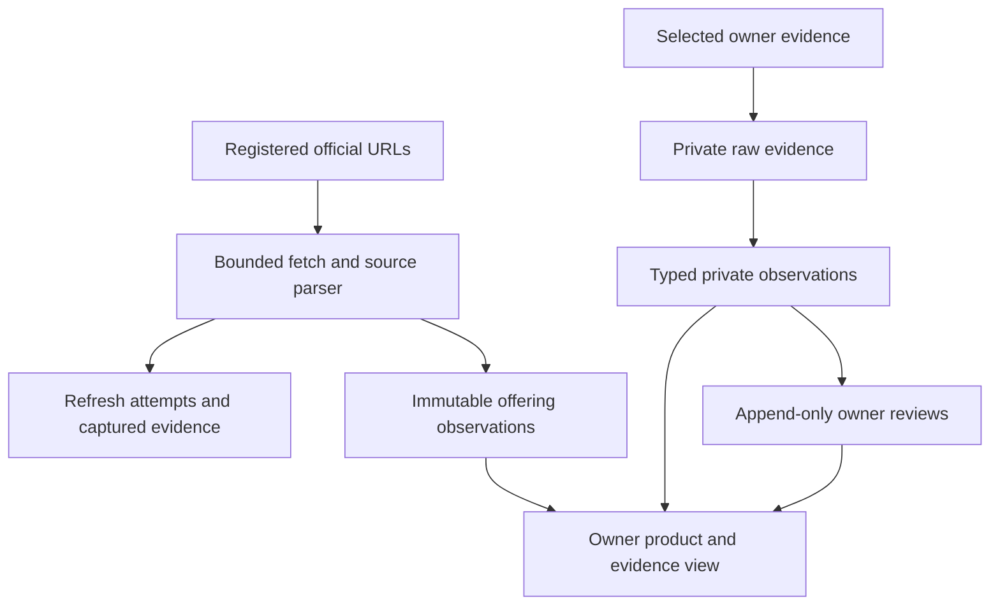
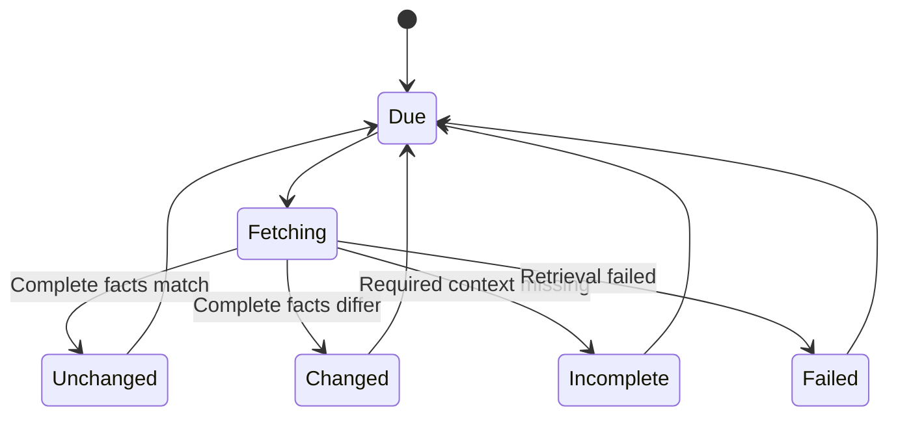

---

> **Status correction — 2026-09-20:** The canonical knowledge/evidence/review foundations described below now exist. Remaining hosted selections, transfer reconciliation and coverage gates are #24. No personal Wispr API or complete usage telemetry is established by the implementation. See [release gaps #24](https://github.com/keeganmoody33/PROPER-RESPECT/issues/24) and the [Phase 0/Devin receipt](../verification/2026-09-20-devin-triage-and-phase0-closure.md).
title: Wispr Product and Usage Evidence - Plan
type: feat
date: 2026-09-16
artifact_contract: ce-unified-plan/v1
product_contract_source: ce-plan-bootstrap
execution: code
---

# Wispr Product and Usage Evidence - Plan

## Goal Capsule

**Objective:** The owner can inspect Wispr Flow's public offerings alongside what their own evidence establishes about subscription, payments, and usage, then record a private verdict without losing the original evidence.

**Means:** Reuse private evidence/reviews and add separate historical public-source observations (KTD1–KTD4).

**Authority and execution:** The authorized Wispr continuation and current product contract govern behavior. Implement, test, and commit task-owned changes on the existing self-test branch. No deployment, publication, mailbox access, or production refresh activation is included. The implementing agent finishes local verification and identifies remaining owner evidence needs. Missing personal evidence is an explicit empty state, not invented data or an implementation blocker.

---

## Product Contract

### Problem Frame

Current observations represent dated signup, use, and paid periods. They cannot faithfully represent an undated subscription statement or a numeric usage total with an unknown measurement period. Pricing lacks a historical observation layer separate from personal costs.

The existing rule is: “Raw evidence, original proposals, and review corrections remain private.” (`docs/000-current-product-thesis.md`, Permission and privacy.)

### Requirements

**Official product knowledge**

- R1. Discover official Wispr pricing and documentation through a reusable source definition with canonical URL and capture time.
- R2. Preserve immutable public offering observations with structured terms, original supporting excerpts, source text/hash, parser version, and any source-stated effective date.
- R3. Recurring refresh distinguishes meaningful changes, unchanged captures, incomplete parsing, and retrieval failures while preserving the last good observation.

**Private owner evidence**

- R4. Accept selected owner-supplied usage and subscription/payment evidence with original payload, verbatim excerpt, attribution, acquisition method, and explicitly known dates or periods.
- R5. Public offerings, actual subscriptions/payments, and actual usage remain separate: allowances never establish usage, list prices never establish payments, and payment periods never establish continuous use.
- R6. Correct, Incorrect, Incomplete, and Unknown reviews append to individual observations; originals and prior reviews remain accessible.
- R7. Intake/review stays private and never automatically changes cost visibility, start dates, or public profiles.
- R8. Private reads/writes enforce authenticated ownership and support later evidence on an existing approved owner card.

### Acceptance Examples

- AE1. Covers R2, R5. A monthly-equivalent annual rate retains both display basis and billing cadence; personal paid amount remains unchanged.
- AE2. Covers R3. Navigation-only changes record a check without a product change; a changed allowance appends a new observation.
- AE3. Covers R3. An unrecognized response or failed fetch leaves the last good state intact instead of interpreting missing values as a removed/free plan.
- AE4. Covers R4, R5. “Words dictated: 12,345” without a period remains 12,345 with period unknown.
- AE5. Covers R6–R8. Incorrect followed by Incomplete preserves both reviews; Incomplete is current and public output is unchanged.

### Scope Boundaries

Implement the official-source pipeline and private owner intake/review. No personal usage API has been established. Provide documented Mac/Windows Insights → Your Usage screenshot guidance; enterprise admin CSV may be supported only as selected owner-supplied evidence with organization attribution intact. Mailbox OAuth, automatic personal usage retrieval, GitHub account verification, and publication are separate work.

---

## Planning Contract

### Key Technical Decisions

- KTD1. **Separate global public storage.** Add `productSources`, immutable `productObservations`, and `productRefreshRuns` in an exported `convex/productKnowledgeTables.ts` definition integrated by `convex/schema.ts`, implemented in `convex/productKnowledge.ts`. Existing `rawEvidence` is owner-bound. Public sources must not invoke `connectors.applyRefresh`, which can patch public props and insert usage signals (R1–R3, R5).
- KTD2. **Reuse private evidence and reviews.** Extend the domain/Convex discriminated observation union for usage and subscription/payment facts without forcing event dates. Retain `rawEvidence`, proof-to-card ownership checks, and `claimReviews`. Add authenticated owner intake for later evidence because current discovery attachment only supports pending drafts (R4, R6, R8).
- KTD3. **Compare facts within source and parser version.** Fetch only registered HTTPS official hosts, validate every redirect, bound time/body size, and persist results transactionally. Compare canonical facts excluding layout and capture time; record parser-version changes as reparsing. Incomplete extraction never replaces complete state. Preserve every successful capture as source evidence, even when semantic facts reuse the prior observation. Duplicate/concurrent persistence is idempotent (R2, R3).
- KTD4. **Use source-specific Wispr extraction behind a reusable adapter.** The official plans table identifies USD explicitly; the pricing page has distinct dictation/notetaker options and may disagree with docs. Preserve each source observation and disagreements rather than silently combining them. Retain normalized visible source text for verbatim excerpt matching alongside raw HTML hash and capture date. A docs cell saying "$12 billed annually" does not establish a $12 annual charge or monthly-equivalent basis without corroborating source context; preserve the ambiguity. Currency remains unknown unless that same source explicitly establishes it. Distinguish annual billing from monthly-equivalent display, unknown from zero, and a bare dollar sign from explicit currency (R2, R5).
- KTD5. **Keep usage metrics private at intake.** Existing `usageSignals` participate in public connector projection. Store source units, value, and period on private typed observations; reuse a `metricDefinitions` identity only when semantics match exactly. Owner evidence is not an authorization for future account refresh (R4, R5, R7).
- KTD6. **Retrieve reviews by claim identity.** Add an index supporting current review per evidence/observation and bounded paginated history. The current latest-1,000-per-prop scan can hide an older still-current verdict; do not carry that limitation into the new review view (R6).

### High-Level Technical Design

### Assumptions and Operational Constraints

Daily refresh is the initial default for explicitly enabled public sources; process a bounded due-source batch. Local implementation/tests do not activate production. Source configuration and scheduled writers are internal. An owner-triggered refresh, if exposed, is authenticated and restricted to registered sources. Preserve the current Clerk identity convention; no identity migration is included.

Official Wispr documentation establishes a personal usage tab and enterprise admin export, not a personal usage API. Only selected owner evidence establishes actual account values. Raw personal artifacts stay outside Git, and committed fixtures are synthetic. Full downloaded public pages also remain outside Git; parser fixtures are minimal attributed excerpts.

### Sources and Patterns

- `docs/000-current-product-thesis.md`: “Usage totals retain their source, attribution scope, and measurement period. Missing periods stay unknown.”
- `docs/003-evidence-surfaces.md`: “The only actor that can advance a candidate past the review queue is the user.”
- `convex/discovery.ts`: excerpt validation, collision checks, immutable payload pattern.
- `convex/onboarding.ts` and `convex/evidenceClaims.test.ts`: ownership, append-only reviews, date semantics and non-publication.
- [Official plans table](https://docs.wisprflow.ai/articles/9559327591-flow-plans-and-what-s-included) and [pricing](https://wisprflow.ai/pricing), checked September 16, 2026: independently captured offering sources.
- [Usage tab](https://docs.wisprflow.ai/articles/8760230576-your-usage-tab-track-your-dictation-stats-in-wispr-flow), [admin export](https://docs.wisprflow.ai/articles/2356896572-admin-usage-v2-team-members-table-and-words-dictated-csv-export), and [billing instructions](https://docs.wisprflow.ai/articles/4152811715-manage-your-billing-invoices-company-details-payment-method-and-cancellation): evidence acquisition options with their access limitations.

---

## Implementation Units

### U1. Public source registry, parsing, and refresh

**Goal:** Preserve official Wispr observations and meaningful historical changes.

**Requirements:** R1–R3, R5; AE1–AE3. **Dependencies:** None.

**Files:** new `convex/productKnowledgeTables.ts`, root integration in `convex/schema.ts`, new `convex/productKnowledge.ts`, `convex/crons.ts`, new `src/domain/product-knowledge.ts`, new `src/server/product-sources/wispr.ts`, corresponding new domain/server tests, new `convex/productKnowledge.test.ts`. Root owns `package.json` and lockfile integration for pinned `cheerio/slim` 1.2.0 parsing.

**Approach:** Implement KTD1, KTD3, KTD4. Source records own refresh control; run records own attempt/capture evidence; immutable observations own parsed facts. Use a bounded scheduler and internal persistence mutation.

**Test scenarios:**

1. Official table fixture retains source, capture time, parser version, currency, billing/display basis and exact excerpts.
2. Layout-only change records unchanged; amount, currency, cadence, allowance or product-option change appends history.
3. Failed fetch, timeout, incomplete response and changed parser structure preserve the last good observation.
4. Disallowed host or redirect is rejected before retrieval; response limits are enforced.
5. Concurrent duplicate persistence is idempotent; disabled sources are skipped and batches bounded.
6. No public refresh writes to personal costs, props, usage signals or published profiles.

**Verification:** Deterministic fetch/persistence tests pass; a current official capture is inspected separately from fixtures.

### U2. Private usage/subscription intake and append-only review

**Goal:** Attach private evidence to the owner's existing card and preserve its review history.

**Requirements:** R4–R8; AE4, AE5. **Dependencies:** None; public and private implementations use owned modules, then root integrates shared schema.

**Files:** `convex/validators.ts`, `src/domain/evidence-claims.ts`, `convex/onboarding.ts` or focused new `convex/privateEvidence.ts`, `convex/discovery.ts` only if extracting a shared helper, `convex/evidenceClaims.test.ts`, domain observation tests.

**Approach:** Apply KTD2, KTD5, KTD6 with backward-compatible dated variants. Retain bounded original payload before accepting traceable excerpts. Existing reviews remain immutable; corrections are new review entries.

**Test scenarios:**

1. Legacy dated claims parse unchanged; usage/subscription with unknown periods do not acquire fictitious dates.
2. Owner intake works for pending and previously approved cards; wrong-owner, anonymous, and wrong-card operations fail.
3. Invalid numeric values, reversed explicit periods, excerpt mismatch and idempotency collisions fail validation.
4. All four verdicts append; originals and prior reviews remain queryable after reload.
5. More than 1,000 unrelated reviews do not hide a claim's current verdict.
6. Intake/review does not change start date, actual cost, visibility, usage signals or public projection.

**Verification:** Convex tests establish owner isolation and original/history preservation alongside existing evidence regressions.

### U3. Owner view, integration, and local verification

**Goal:** Make public offerings and private personal evidence usable together without conflating them.

**Requirements:** R1–R8; AE1–AE5. **Dependencies:** U1, U2.

**Files:** `src/components/onboarding-flow.tsx` or existing owner-review components, focused new product/evidence components as needed, relevant `src/app/onboarding` entry, browser test under the repository's existing e2e directory, `docs/2026-09-16-self-test.md`.

**Approach:** Use separate labeled regions for official terms and private account evidence. Show capture/event times, unknown measurement windows, acquisition/scope, original excerpt, current verdict and history. Empty states link official evidence instructions; existing publication controls retain their behavior under R7.

**Test scenarios:**

1. Missing personal evidence shows a targeted request without fabricated usage or subscription.
2. Public allowances/list prices display separately from usage and actual paid amounts.
3. Submit selected evidence, append two verdicts, reload, and inspect original plus both reviews.
4. Failed/incomplete refresh shows status and last successful observation time.
5. Keyboard and narrow-screen review/intake/history interactions work.
6. Public profile output before and after private operations is identical.

**Verification:** Local browser integration proves the flow and disclosure boundary; document exact checks and remaining real-evidence needs.

---

## Verification Contract

Run the repository's `npm test`, `npm run lint`, `npm run typecheck`, and `npm run build`, plus targeted `npm run test:e2e` where authenticated local fixtures are available. Include negative authorization, malformed official responses, semantic no-change, concurrency/idempotence, and public projection non-disclosure. Never use production writes as test setup. Read generated Convex guidance before code changes and use supported interval/cron scheduling for new work.

---

## Definition of Done

The owner can inspect an official observation, attach private usage/billing evidence, append a verdict/correction, and revisit original evidence and history. Refresh tests prove historical preservation and meaningful change detection. R5 and R7 remain true through integration tests. Relevant local checks pass or their concrete environment limitation is recorded. Commit only task-owned changes on the authorized branch; preserve original-checkout bytes. Remove abandoned experimental code. Report exact check/commit evidence and missing personal evidence without claiming deployment, publication, or live production refresh.
