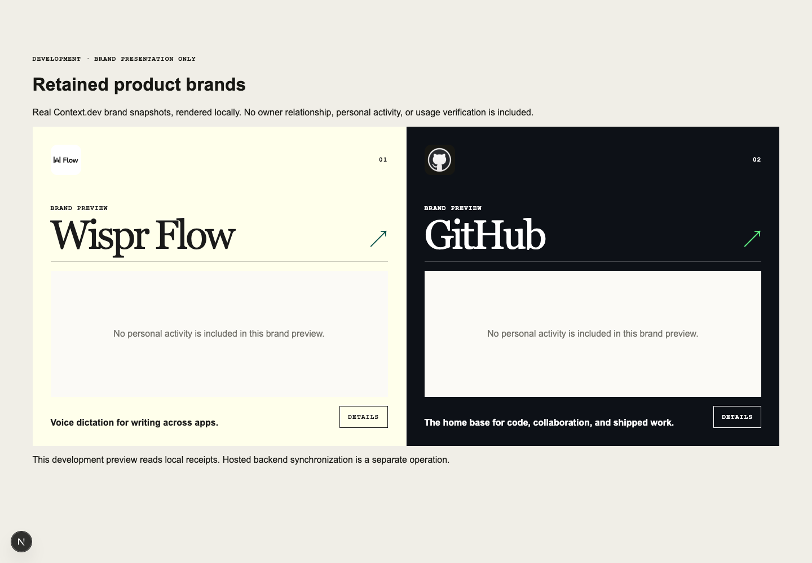

# Context.dev brand enrichment — September 17, 2026

Implementation checkout: `/Users/keeganmoody/Downloads/PROPER-RESPECT-self-test-20260916`, branch `codex/proper-respect-self-test-20260916`. Base: `048571f97b2ab03f58f6515d1877fc2e4b2ff329`. Canonical direction: [Updated Proper Respect Ref](https://plan.ref.tools/oUl8LCIQb32SAicK). This is a bounded presentation capability within the existing Tasks 1–4 plan.

## Real provider retrieval and retained records

The generic adapter fetched both canonical catalog products from Context.dev. All three endpoints returned HTTP 200 for each retained retrieval. An earlier attempt failed before a receipt was written; the successful records below, rather than that attempt, are the proof.

| Field | Wispr Flow | GitHub |
| --- | --- | --- |
| Canonical slug / domain | `wisprflow` / `wisprflow.ai` | `github` / `github.com` |
| Retrieval | `d97a283c-d7f8-4d60-af5b-79ee8f9b7069` | `b9a13a5c-f5af-4895-93d3-6e57a959f43a` |
| Retrieved at (UTC) | `2026-09-17T23:12:06.674Z` | `2026-09-17T23:13:19.234Z` |
| Adapter | `context-brand-v1-2026-09-17` | Same adapter |
| Available fields | 2 logos, 4 palette colors, 2 font families, styleguide | 2 logos, 4 palette colors, 3 font families, styleguide |
| Partial | `false` | `false` |
| Selected logo | `light` logo, 82 × 23 | `dark` icon, 512 × 512 |
| Styleguide background / text / accent | `#ffffeb` / `#1a1a1a` / `#034f46` | `#0d1117` / `#ffffff` / `#5fed83` |
| Fonts returned | Figtree; Eb garamond | Mona Sans VF; Mona Sans; Mona Sans Mono |
| Heading / body family metadata | EB Garamond / Figtree | Mona Sans / Mona Sans |

Complete retained normalized records, request descriptors and allowlisted response projections:

- [Wispr Flow](fixtures/2026-09-17-context-brands/wisprflow.json), SHA-256 of its compact response projection: `1b8f773b7a02dd50f0a16f951bfe38eb38aa83dc2e89e2f7d14d5b83cebb9ea7`.
- [GitHub](fixtures/2026-09-17-context-brands/github.json), SHA-256 of its compact response projection: `74fe1be2e35852c094c523d00abb80bb020ae03663e528d275767e2401e078ce`.

These committed fixtures contain public brand metadata, not personal evidence. The original local receipts are retained outside Git in `/Users/keeganmoody/Documents/PROPER-RESPECT-private/2026-09-17-brand-retrieval`. The key lives only in ignored local configuration, never in these records. The hash covers the explicitly versioned presentation projection, **not the entire original HTTP body**; account/credit metadata, arbitrary CSS and font-file payloads are discarded.

The adapter uses the documented [brand](https://docs.context.dev/api-reference/brand-intelligence/brand), [fonts](https://docs.context.dev/api-reference/brand-intelligence/fonts) and [styleguide](https://docs.context.dev/api-reference/brand-intelligence/styleguide) endpoints. The request shape, with authentication removed, is:

```http
POST https://api.context.dev/v1/brand/retrieve
Authorization: Bearer [REDACTED]
Content-Type: application/json

{"type":"by_domain","domain":"wisprflow.ai","timeoutOpts":{"milliseconds":60000,"behavior":"return-partial"}}
```

The optional GET requests are `/v1/web/fonts` and `/v1/web/styleguide`, each with `domain=wisprflow.ai` and the same JSON-encoded `timeoutOpts`. GitHub changes only the canonical product input. Supported response fields are `brand.domain`, `brand.logos[]`, `brand.colors[]`; `fonts[]` with `font`, `uses`, `fallbacks`; and `styleguide.colors`, `styleguide.typography.headings.h1.fontFamily`, `styleguide.typography.p.fontFamily`. Provider request IDs and per-endpoint status are retained. A returned domain must match the verified input; provider data cannot rename the canonical product.

## Retention and card integration

`src/domain/product-brand.ts` defines a strict presentation-only snapshot. `src/server/context-brand.ts` owns HTTP, size/time limits, validation, normalization and projection hashing. `convex/productBrands.ts` queues enrichment when a canonical relationship becomes displayable, retains immutable snapshots, and supplies explicit retry/refresh. No card render initiates Context.dev retrieval.

Jobs are shared by canonical product, independently of owner evidence. Only an authenticated owner of an existing relationship may request its brand. A job generation can be claimed once. Identical retention replay returns the same snapshot ID; a conflicting replay is rejected. A later refresh appends history, and a late older generation cannot replace the current selection. Failed refresh preserves the last valid snapshot. Canonical product/domain validation also runs on reads.

Private review and public profile projection consume the retained snapshot through the existing `ProductCard`. Enrichment does not insert or change sources, captures, usage signals, claim review, owner relationship facts or publication records. Automated tests exercise private and already-published card projection with the real retained Wispr and GitHub snapshots; those tests use synthetic owners and relationships, not the user's account.

The local development preview at `http://localhost:3000/evidence-fixture/brands` uses the same card component with the real retained receipts. It hides relationship state and all personal activity; it is explicitly labeled brand presentation only. It does not establish a live hosted Convex record.

## Fallback and provenance behavior

- Wispr has no explicit dark logo variant in this response. Surface-matching variants win, then unknown, then the opposite variant with a suitable backing. A failed image moves to another retained variant, the canonical legacy logo if present, then product initials.
- Palette arrays remain descriptive. Only explicit opaque styleguide background/text pairs meeting 4.5:1 contrast affect the card; a readable accent is optional. Invalid, missing or low-contrast roles keep existing styles.
- Missing fonts, colors, logos or styleguide are accepted. Optional endpoint failure creates a partial snapshot with honest receipts. Font family names are inspectable; external font files are not loaded or invented.
- Details exposes provider, canonical domain, retrieval time/ID, adapter version, response hash, available fields and endpoint status. Brand lookup never verifies product use or an account relationship.

## Verification

- `npm test`: 258 Vitest tests across 28 files and 5 Node tests passed (263 total).
- `npm run lint` and `npm run typecheck`: passed.
- `npm run build`: passed after deferring Zod's ISO-schema initialization; date validation remains strict.
- Compound Engineering review `20260917-192444-092e7d3f`: complete, **Ready to merge**, no actionable findings after independent validation of the six repaired surfaces. Receipt: `/tmp/compound-engineering-501/ce-code-review/20260917-192444-092e7d3f/review.json`. This is a local code verdict, not release/deployment approval. Nonblocking automated-coverage gaps remain for the image-error interaction already browser-verified and public projection when a canonical product row disappears or changes domain.
- Normalization/adapter checks cover verified-domain mismatch, malformed or missing fields, credential-bearing asset URLs, bounded responses/timeouts, optional endpoint failures, light/dark selection and discarded provider account metadata.
- Convex checks cover ownership, canonical eligibility, job deduplication, replay/collision, refresh history, stale completion, failed refresh and unchanged evidence/publication state. The provider test executes the scheduled job through HTTP mocks and retention. Real Wispr/GitHub fixtures survive persistence and repeat projection.
- Component checks cover exact product/domain matching, legacy/initial fallback, explicit color roles and contrast, unchanged activity semantics, and brand-preview non-claims.
- Review caught and regression tests closed three integration defects: duplicate relationships now queue one brand job per canonical product within publication projection; private brand controls mount only when `onboarding:getState` advertises the new backend capability, so the existing unsynchronized development backend remains usable; stranded pending/running jobs keep an explicit retry available, with backend guards preventing duplication until the lease expires.
- CLI replay for both existing receipt paths printed `no provider request made`; neither replay created a new retrieval.
- Browser: existing card rendered both real logos at 1440 × 1000 and 390 × 844; no horizontal overflow at 320, 390 or 1440 pixels. Details fit the 320-pixel viewport, Escape closed the dialog and restored focus to Details. Simulated logo-load failures stepped from Wispr's light logo to its icon and then `WF`; reload restored the retained logo. No browser errors were reported. Browser resource entries contained zero `api.context.dev` requests after render/reload.
- Review also identified a pale focus outline on Wispr's light card. It now follows the validated brand foreground; browser computed styles confirmed charcoal `rgb(26, 26, 26)` on cream `rgb(255, 255, 235)`. The title divider also follows the foreground.
- A local production-build server returned HTTP 404 for `/evidence-fixture/brands` and no retained receipt data. The first smoke attempt used the wrong hostname for the existing Clerk proxy and was discarded; the valid check used `localhost:3011`. The temporary production-build process was then stopped; the normal development server remains on port 3000.



[Mobile cards](assets/2026-09-17-context-brands/mobile.png) · [Wispr provenance on mobile](assets/2026-09-17-context-brands/wispr-provenance-mobile.png) · [Wispr keyboard focus](assets/2026-09-17-context-brands/wispr-keyboard-focus.png)

## Deployment boundary and remaining operation

No push, deployment, account connection, mailbox read or publication occurred in this slice. Hosted `utmost-mongoose-374` remains on its previously accepted functions. New brand persistence was verified in `convex-test`; the live adapter and real retained local card were verified separately. Do not describe that as a live hosted owner-to-Convex brand proof.

The next environment operation, when separately authorized, is to synchronize the committed brand schema/functions and server-only key to **development `utmost-mongoose-374` only**, then load an existing owned canonical private card, verify the retained backend snapshot after reload, and confirm personal evidence/publication records are unchanged. Production and preview remain outside that operation. Existing Wispr evidence ingestion is independent and unchanged.
