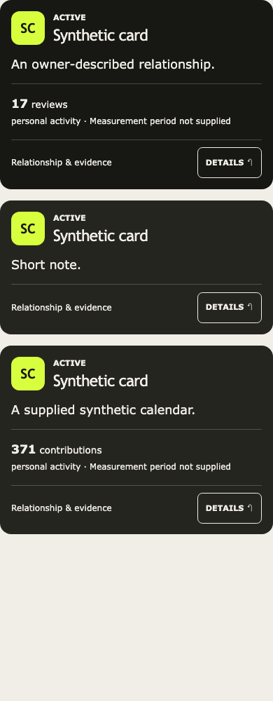
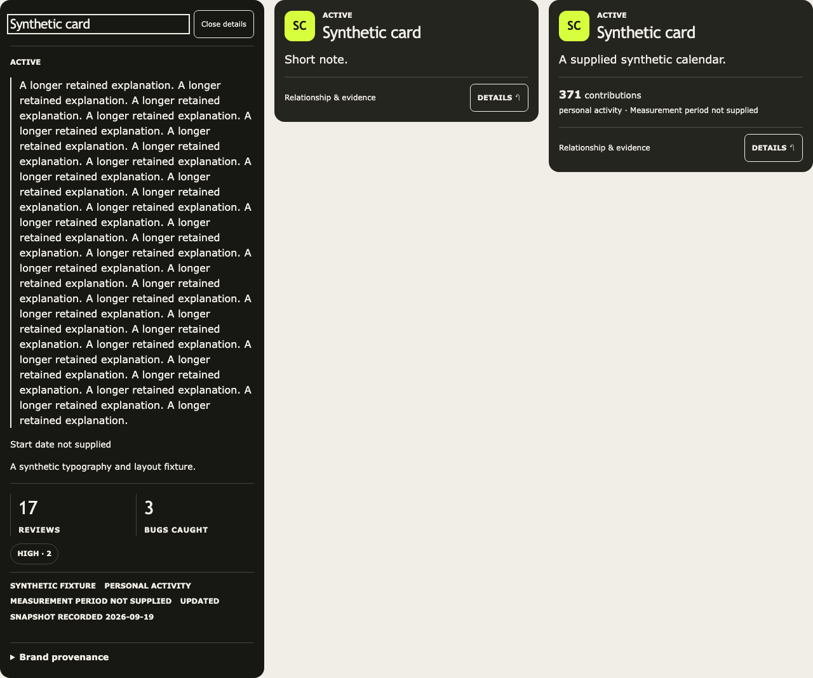

# Hosted card correction verification

Date: 2026-09-19, America/New_York. Base `833b1574c67bc93727c3e0df3f704e66ebd912d8` on accepted `codex/personal-release-main`. Existing Tasks 2/4. [Owner comments and clarification](../feedback/2026-09-19-hosted-card-comments.md).

## Behavior implemented locally

- One private product card groups accumulated owner/product records. A record selector preserves access to each original relationship, note, evidence and history. Filter changes reset inspection to a matching record. This is reversible presentation grouping, not a database merge or canonical relationship choice.
- Ingestion reuses an explicit valid draft mapping or a unique existing owner/product relationship. Ambiguity retains evidence in a pending draft without creating another prop or choosing between existing records. A manual Gmail result explains the unresolved association; batch replay retains that outcome.
- Existing displayable products enter owner-checked brand preparation in bounded batches of 25. Retained valid snapshots are reused; retries are explicit after failure, and no card render calls Context.dev. Pending, unavailable and unresolved product identity are visible.
- Context.dev parent branding is rejected for shared-domain subproducts (including Copilot/Devin Desktop) and the observed NotebookLM parent-logo response. Public projection also rejects unsupported embedded snapshots without rewriting stored publication.
- Card fonts use retained heading/body roles throughout, including status and controls. Fronts have natural heights, details expand in page flow, supplied calendars fit mobile, and keyboard/reduced-motion behavior remains intact. Visitor cards omit missing-activity filler; private cards suggest adding a snapshot or history.
- Sharing exposes canonical/affiliate/referral/invite link purpose. Affiliate/referral links are visibly disclosed and carry `sponsored`. No affiliate URL is inferred, no publication occurs. Intro copy reflects changing stacks; avatar is 48px.

## Actual hosted brand operation

Using the existing authenticated hosted UI and already-configured provider, requested presentation-only retrieval for `github.com` and `notebooklm.google.com`. No source account or usage API was read.

GitHub completed with a loaded Octocat image, dark/light icon variants, four colors, Mona Sans VF/Mona Sans/Mona Sans Mono families, font assets and a partial styleguide. Retrieved `2026-09-19T09:47:05.439Z`, adapter `context-brand-v2-2026-09-18`, response hash `b2c0deaecdc2033684118ae820fd38a60a047286b52adda2943ccaf38820e64a`. Hosted DOM confirms a loaded image and scoped Mona Sans heading font. Existing hosted CSS still contains the mixed-font/internal-scroll defects fixed locally.

NotebookLM's exact-domain request completed but visibly supplied a Google G logo, not a verified NotebookLM product asset. It is a negative identity-verification result, not successful product branding. The locally implemented guard prevents its use after synchronization. No Copilot or Devin Desktop parent-domain lookup was performed. Verified product-specific assets remain outstanding for all three.

A private production export after these operations was compared with the prior release export. Of 32 application tables, only `productBrandJobs` and `productBrandSnapshots` changed. The other 30, including props, raw evidence, relationship events, links and stored published profiles, are unchanged. Public rendering may hydrate new presentation metadata; no personal information was newly published. Exports and detailed comparison stay outside Git.

## Checks

- `npm test`: 484 Vitest tests passed, one optional private-file test skipped; all six Node tests passed.
- `npm run lint`, `npm run typecheck`, `npm run build`, `git diff --check`.
- `npx playwright test --config tests/e2e/components.config.ts`: three passing synthetic component-browser checks. Desktop 1280px/mobile 390px, real React component interaction, supplied 371-day calendar, scoped fonts, natural heights, no internal/horizontal scrolling, Enter/Escape/focus return, reduced motion, multiple-record inspection/filtering, no save callbacks. Previous CSS fails both typography regressions with Courier New instead of the fixture brand body font.
- Independent bounded review of grouping and ingestion diffs found no introduced blocker.

These component screenshots contain synthetic fixtures, not owner usage:

## Residual limits and next operation

The owner subsequently approved development-only synchronization of this checkpoint; [the sync receipt](2026-09-19-card-development-sync.md) records successful installation and authenticated runtime verification. The new application/backend code is not deployed to production. Hosted production remains application `d2266fa`, Vercel `dpl_DD4jWfKFtrCKYAPxvK8ufntusCW6`, Convex `striped-chicken-693`. A new exact-source release requires its applicable approval. No data migration, record deletion, development evidence transfer, recurrence, provider usage read or publication was performed.

The owner must supply their actual Wispr affiliate URL in the sharing editor; none was present in the inspected records. Richer development activity is not copied to production. The current hosted GitHub record lacks an attached activity capture, so no real usage graph was manufactured. Existing contribution data must remain labeled contributions, not commits.

Presentation grouping preserves all records but does not resolve competing saved relationships. Other connector/manual intake paths still require the separate shared canonical-resolution follow-up before claiming universal duplicate prevention. Unmapped ambiguity is retained privately; the manual result notice is not yet a persistent dashboard reconciliation tool. Scheduled batch receipts preserve it, but unattended maintenance remains paused/unproved. Product-specific logo verification for NotebookLM, Copilot and Devin Desktop remains open. The overall personal release is not complete.
