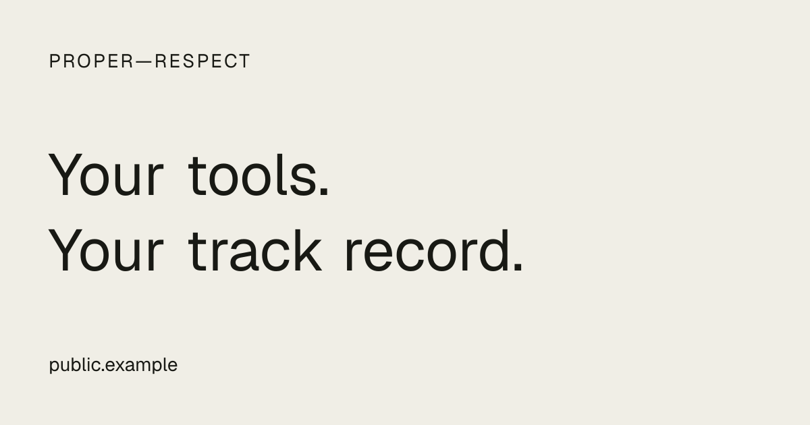

# Canonical public origin — source preparation

Date: 2026-09-20. Branch: `codex/canonical-public-origin-20260920`.
Original base: `d27920adc5c0e6af3b7597a6e93126df0c5af490`.
Current rebased base: `e086131a03d7a68ea50b2feca298a11d152a40f5`.

## Merge and hosting baseline

Owner merged #25 at `6beb595586a63cd37c0e2c5edcb14357a16bc85a` and #26 at
`d27920adc5c0e6af3b7597a6e93126df0c5af490`; GitHub confirms both original heads
(`5c84e5b` and `5be3674`). The accepted checkout was clean before branching.

Read-only Vercel project inspection verifies `groundskeep/proper-respect`,
project `prj_yxsUnnPW0ka8mkFr7l66eUSzJgT8`, team
`team_MfB5K2Npy5oy5SFJ2g9nbL5W`. Current READY production deployment remains
`dpl_8zGq3Exu68QgVvCKmdy4Hm9SoRTh`; no new source was deployed.

The project domains endpoint confirms both domains verified:
`proper-respect.com` has a 307 redirect to `props.lecturesfrom.com`; the latter
has no redirect. Anonymous HTTPS checks confirm the apex onboarding 307 and
old-host `/keegan` and `/sign-in` HTTP 200. These checks do not prove signed-in
fallback, new-host authentication or callback continuity. The CLI's standalone
subdomain inspection returned an access error; the authenticated project-domain
listing and live HTTPS responses establish assignment and public reachability.

Vercel's production environment inventory has no `PUBLIC_SITE_ORIGIN` entry.
Clerk and mailbox configuration entries exist. Sensitive entries redact values;
an absent returned value does not mean a missing credential. No secrets were
printed or retained in this receipt, and no environment values were changed.

## Source correction

One validated server-side public origin supplies canonical profile/landing URLs,
OpenGraph/Twitter metadata, a generic PNG share image and root-only sitemap.
It is independent of mailbox origin and Clerk configuration. Preview pages and
private onboarding are noindex. Existing published-only profile reads supply
profile metadata; no private collection query or stored state is added.

The image route uses a `.png` suffix so it cannot shadow a valid profile handle.
Profile enumeration in the sitemap is intentionally absent: no new owner-list
query or publication/indexing policy is introduced by this slice.

## Review disposition

Independent read-only review identified `/share-image` colliding with valid
profile handles. **Fix now:** use `/share-image.png`, which the handle schema
cannot accept, preserving existing and future `share-image` profiles. Record
this disposition before the correction and reproduce the collision with a
browser regression. No other source blocker was reported. Devin remains a
reporter; no external agent commits were incorporated.

The collision regression failed with HTTP 200 PNG before the rename, then passed
with the dynamic profile's expected HTML 404 for an unpublished fixture handle.
Independent reinspection confirms the collision is resolved.

## Verification

- RED: four existing-profile metadata assertions failed before implementation.
- GREEN: 14 focused metadata/origin tests; six deployment preflight checks.
- Full suite: 630 Vitest tests pass, two optional tests skip, seven Node checks pass.
- Four Playwright checks pass, including desktop/mobile profile metadata,
  1200×630 PNG validation, private/missing-profile noindex and the route collision.
- Lint, typecheck, production build and diff whitespace checks pass.
- Local production server `/` emits canonical, OpenGraph and Twitter tags using
  synthetic `https://public.example`; `/share-image.png` renders a legible generic
  image, visually inspected. No owner information appears in the image.

Build and browser checks explicitly use synthetic origins and provider settings.
Production configuration, actual hosted sign-in and apex cutover are not proven
by these fixtures. No Convex source files changed in this slice.

## Concurrent branch discovered

While this slice was being verified, Cursor opened PR #27 at
`56900a0d1bfc848944689b219b119761ca58c674`, branch
`cursor/github-capture-chronology-7318`, at 18:53:34 UTC. Its body identifies
the existing Cursor worker and base d27920a. GitHub lists the owner as PR author;
this is not evidence of a Devin-authored commit. Its four-file chronology change
has not been adopted, reviewed for acceptance, merged or modified here.

The owner requires one active feature branch and reporting unexpected drift.
Preserve this verified Phase 2 slice as a clean local checkpoint; defer pushing
another feature PR until the owner chooses how to serialize #27 and Phase 2.

## Remaining authorization and release gates

The existing deployment runbook records cutover and rollback ordering. No domain,
DNS, TLS, Vercel environment, Clerk, Google client or Convex configuration changed.
No provider read, data transfer, publication, user choice or recurring job changed.
Local/browser fixtures are not a hosted migration proof.

Before native apex release, separately authorize exact-target Clerk/OAuth/domain
configuration, verify old-host signed-in fallback, and preserve owner identities.
Then approve source release with backend-first upload synchronization, native
apex verification, and only afterward old-host redirect demotion. Never set both
hosts to redirect to each other. Rollback preserves data and previous auth/origin
configuration. The generic image does not publish any owner's profile.

## September 20 owner-authorized continuation

Owner merged #27 at `e086131a03d7a68ea50b2feca298a11d152a40f5`.
The existing Phase 2 branch rebased cleanly from `5935783154d3c575d72a92d31ceaf8317aaad813`
to `8ea5384cf1a1f173237ad33b8af5f22b7d18a73d` on that main.

Before edits, full browser verification returned 40 passes and one failure:
`public-profile.spec.ts` expects the obsolete heading “Tools with a track record.”
Main already renders the owner's display name as its h1. FIX NOW: correct this
stale test assertion; preserve the rendered product and privacy/accessibility
assertions. A trial link-label adjustment failed because card details retain
the original link label; it was reverted. The only final test repair is the h1
expectation. This is verification repair, not a UI change.

Owner-authorized remote cleanup used `git merge-base --is-ancestor <head> origin/main`
for each branch and deletion pushes guarded by exact-head leases:

- `codex/phase0-closure-ticket-recut-20260920`: `5c84e5baef172d5d14e357131f88ef916a8941c9`.
- `cursor/upload-replay-issuer-7318`: `5be36742576892849bc208e18614be22264b1260`.
- `cursor/github-capture-chronology-7318`: `d024b6c3fff05f5c904d58420d1fd7bae4ba4b53`.

GitHub listing confirmed all three absent. Local branches and worktrees remain.
Issue #24 now marks #26/#27 as merged, not deployed, and reconciles #25 status;
remaining issue scope stays intact. The before/after issue bodies and verification
logs are machine-local under `/tmp/proper-respect-phase2-20260920` (temporary).
Concurrent Cursor PR #28 at `bfb0e2eed99288192b1662ec746bd06d51afdfb0`
was observed and preserved; it is not incorporated in this source slice.

### Rebased verification results

September 20 America/New_York / September 21 UTC. Executable source head:
`8ea5384cf1a1f173237ad33b8af5f22b7d18a73d`; the follow-up changes only this
receipt, the runbook baseline, one stale test assertion, and the generic image
verification artifact. Final pushed SHA is recorded in the PR and canonical Ref.

- `npm test`: 638 Vitest passed, two optional skips; seven Node checks passed.
- `npm run lint`: passed.
- `npm run typecheck`: passed.
- `npm run build`: passed with CI synthetic Convex/Clerk/public-origin settings.
- `npm run test:e2e`: 41 passed after the h1 assertion repair, including desktop,
  mobile, public projection accessibility, canonical/OG/Twitter metadata,
  1200×630 image bytes, missing-profile privacy, private noindex and root sitemap.
- Separate browser inspection with `VERCEL_ENV=preview`: `/`, `/keegan` and
  `/onboarding` each render `noindex, nofollow`.
- `git diff --check`: passed.
- Diff against main contains no Clerk/OAuth, application-provider, proxy or
  Convex changes. No environment values or deployed settings were changed.

The generic share image was fetched from the local synthetic preview, visually
inspected for legibility and absence of owner content, and retained below.

These checks are synthetic local verification, not hosted authentication or
cutover proof. The runbook preserves old-host TLS, profile, sign-in and callbacks
before and after separately authorized Clerk/OAuth cutover, with explicit
redirect ordering and rollback. No deployment or backend synchronization ran.

After this PR is owner-merged, the next authorized source slice is the fresh-user
journey: signup → private collection → first evidence source or manual entry →
first useful card → exact sharing preview. Acceptance requires two-user isolation,
fresh login, reconnect/revocation, no accidental publication and preservation of
the existing profile. Clerk/OAuth cutover still requires separate exact-target
authorization and before/after old-host fallback verification. Personal AI usage
wording remains gated on a privately validated Codex metadata-only import with
visible coverage and caveats. No new slice was implemented in this PR.
