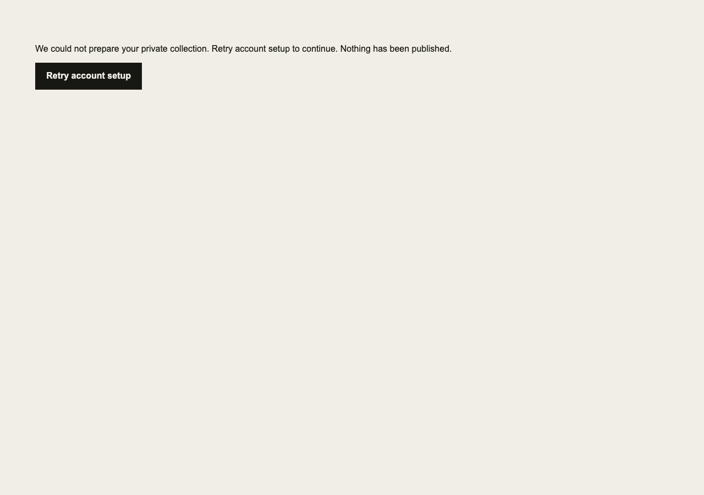
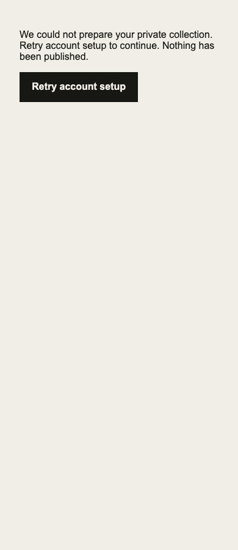

# Fresh-user readiness — September 20, 2026

Baseline: `bb108413d937abb9082f88fd3ded3e168f93e574`.
Branch: `codex/fresh-user-readiness-20260920`.

## Pre-edit finding disposition

FIX NOW: `Builder` fires `ensureAccount` without handling rejection and renders
“Loading your profile…” whenever the owner state is null. A failed initial
account write can strand a signed-in new user indefinitely without recovery.
Reproduce with the real onboarding component and a rejected synthetic account
mutation, then verify explicit retry and successful private collection entry.
Keep account setup idempotent, avoid leaking raw backend errors, and do not
change existing profiles, provider access or publication.

## Deployment observation

Read-only Vercel inspection still identifies production as
`dpl_8zGq3Exu68QgVvCKmdy4Hm9SoRTh`, created September 19, with aliases for both
proper-respect.com and props.lecturesfrom.com. This does not prove source parity
with current main or deployed Convex parity. No deployment was performed.

## Completion requirements still open

Actual hosted signup, fresh login, first evidence/manual card, two-user isolation,
reconnect/revocation and exact sharing preview require fresh acceptance evidence.
No live writes, provider reads or publication are implied by local fixtures.
Clerk/OAuth/domain cutover and deployment need separate explicit authorization;
old-host fallback must be checked before and after. Existing profile/data must
survive. Incoming designs are not yet supplied. AI usage claims remain gated.

## Account setup regression and correction

RED: two real-component browser fixtures (1280px/390px) reached “Loading your
profile…” after a rejected synthetic `ensureAccount` call, with no alert/retry.
GREEN: both show a sanitized error, disable retry while pending, and render
“Add a product” after successful retry without showing a publication action or
raising an unhandled browser error. The underlying backend mutation remains
unchanged and idempotent. No real accounts were created.

The effect now depends on stable identity fields and ignores results after
unmount. Existing collection rendering is not blocked by an account-setup
failure if its state is already present. Backend query outages remain distinct;
this slice handles initial account mutation failures only.

Validation on this corrected tree:
- 638 Vitest tests passed; two existing optional skips; seven Node checks passed.
- Lint and typecheck passed.
- Synthetic production build passed with the CI Convex URL, Clerk key and origin.
- All 43 Playwright checks passed; the two recovery checks passed again after
  adding desktop/mobile screenshots. Screenshot assets contain synthetic text.
- `git diff --check` passed. No backend/auth configuration or deployed state changed.

The regression was added to release queue #24. This correction is one bounded
readiness slice, not proof of the full hosted journey or completion of the goal.
