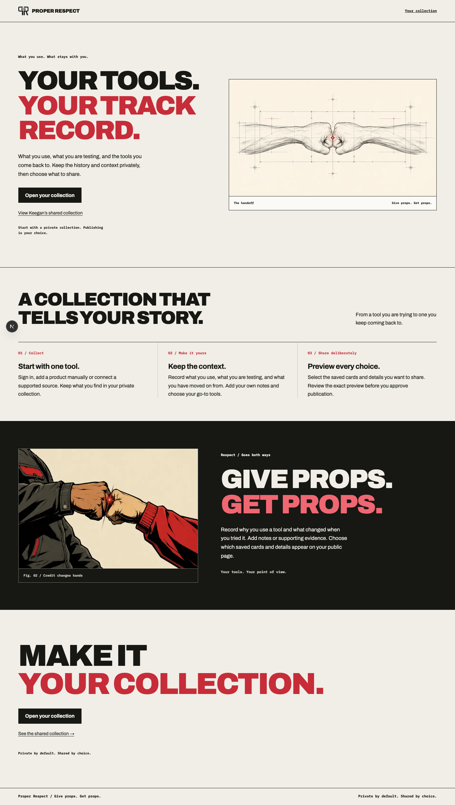
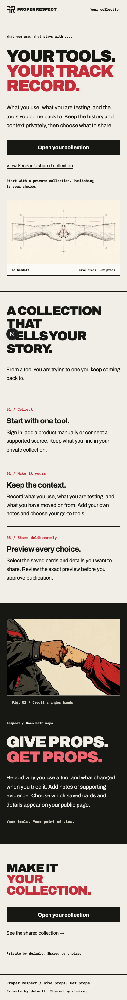

# Design refinement verification, September 21, 2026

Verified application head: `24ffd2d263b3ffa65aafa52ac4e4f274e9e826cb`.
Base and current production head: `dbbc42770ea9ad1c70477698b70792c0585d07c7`.

## Owner direction

Restore the supplied Kimi design's visual idea, including the missing bottom fist bump. Carry it through all pages. Product cards must retain the identity of the brand they represent. Ground copy in supported behavior and apply pstack unslop.

## Changes

The homepage now includes the supplied bump-art.png, its framed caption, a dark illustrated section, and a separate closing call to action. The image matches the archived original byte for byte. The earlier release included only the blueprint hero image.

The root layout loads the existing self-hosted Archivo and IBM Plex Mono fonts and supplies a shared wordmark, navigation, keyboard skip link and footer. Sign-in and signup use a shared illustrated frame. The Clerk appearance configuration changes colors, font and corner radius only. Collection, public profile, setup and error headings use the same page typography. Existing collection operations, identity settings and public metadata are unchanged.

Product cards retain their existing --brand-card-* colors and typography, logo selection and verified product assets. Page heading selectors now target direct children so they cannot override nested card headings. The branded-card fixture uses a deliberately different surrounding font and nests cards inside collection/review containers to verify that separation. Missing brand data still uses the existing fallback. This change does not claim every product already has a complete brand snapshot.

The supplied prototype's referral-chain behavior, measured usage figures, timing claims and custom-domain support are not added as public promises. The new copy describes saved notes, supporting evidence and explicit sharing choices.

## Verification

- npm test: 671 tests passed, two optional skips, seven script checks passed.
- npm run lint and npm run typecheck passed.
- Production build passed with the repository's synthetic CI configuration. No production secrets or deployment command used.
- All 50 browser checks passed, including homepage widths of 1440, 390 and 320 pixels, loaded artwork and fonts, keyboard skip navigation, link destinations, metadata and accessibility checks, and card brand/font fallbacks.
- Actual local browser inspection covered the restored dark section at 320 and 1440 pixels and the public-profile page at desktop width.
- The first narrow-screen check found closing-title overflow at 320 pixels. Lowering its minimum font size fixed it. A metadata unit test required a next/font/local mock after moving font initialization into the root layout. A resource-intensive existing unit test timed out during concurrent browser testing; the complete unit suite passed when run on its own.
- The local Next dev server rejected an external node_modules symlink. A clean npm ci in the isolated worktree resolved startup. No runtime workaround added.

## Screenshots

Screenshots use local fixtures. They are visual evidence, not hosted account acceptance. The third-party Clerk widget with the new appearance still requires review in a configured preview; type checking and build passed, but no live auth settings were changed. No merge or deployment occurred. Existing production fresh-login evidence applies to the deployed base, not this design revision.
