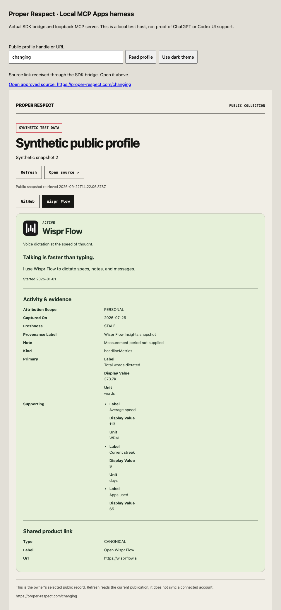
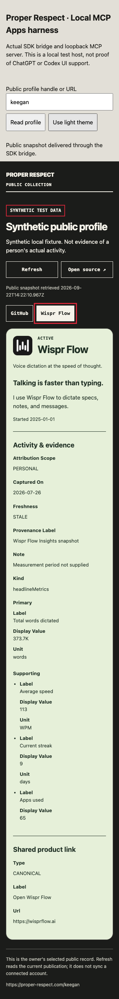

# Local public-reading MCP prototype — September 22, 2026

Implementation SHA: `c408230376e5c01eec29ba354c32038967b80dda`.
Base: `32a851f18632af984e56ab2d761ebc47be870340`.
Ref: https://plan.ref.tools/d6fedvHQMy4bpEJW, Task 8.

The owner approved a local prototype with two public-only tools and a branded card panel, using no new paid service. This receipt covers that bounded result. It does not record a public endpoint release, private integration, ChatGPT UI acceptance or an Ora score increase.

## Implemented experience

`get_public_site_guide({})` returns the factual public guide. `get_public_profile({profileReference})` accepts one handle or its canonical Proper Respect URL and reuses the exact existing anonymous reader and visible-profile projector. An arbitrary URL cannot become a fetch target. Missing and unpublished profiles are indistinguishable; a published empty profile remains a successful result.

The result preserves all current evidence variants, periods, provenance, capture dates, freshness, cost basis and uncertainty. A separate presentation overlay permits only vetted bundled logo keys and validated colors; unknown products remain neutral. The explicit `dataMode` distinguishes synthetic fixtures from published data without modifying the exact profile projection.

The real `ui://proper-respect/public-profile/v1.html` MCP Apps resource renders the cards, supports selection and explicit refresh, and asks its host to open the source. Refresh reads the returned publication; it does not sync a provider. Text and structured results remain available to clients without UI support.

## Runtime proof

| Surface | Actual result |
| --- | --- |
| Existing reader in standalone Node | Fixture and bounded anonymous production read passed; no copied Convex adapter or Next request context was needed. |
| SDK-v2 MCP client over HTTP | Initialize, discover exactly two tools, invoke, validate output, list/read resource and error paths passed. |
| Installed Codex 0.153.4, synthetic | Fresh ephemeral app-server session connected, discovered both tools and invoked both successfully. Profile result was labeled synthetic with two fixture cards. |
| Installed Codex 0.153.4, published | Separate local server used only the current public Convex URL. Both calls succeeded; profile result was labeled published and returned GitHub, Wispr Flow, NotebookLM and Devin Desktop at `2026-09-22T14:31:45.776Z`. |
| MCP Apps bridge harness | Actual SDK Client, AppBridge, App and resource through separate-origin sandbox frames; four browser cases passed. |
| Parent in-app browser | Rendered panel inspected; selected Wispr Flow and completed a real MCP refresh, observing updated retrieval time. Narrow dark presentation and evidence caveats remained readable. |

Codex proof used process-only configuration overrides and an ephemeral protocol session, with zero model turns. It establishes the installed client's transport/tool path, not model selection quality or Codex rendering this panel. No persistent MCP registration or user configuration was written. Fixture and published proofs are retained separately in private execution records. All prototype listeners were stopped after verification; loopback ports 8848–8850 had no remaining listeners.

## Checks

- Nested `npm test`: ten tests passed; independently repeated by the reviewer. Covers strict references, exact projection/private sentinels, mode labels, neutral unknown branding, contrast fallback, empty/unavailable results, malformed responses, request/result bounds, deadline/admission behavior, hosted-runtime rejection and actual loopback SDK calls.
- Nested build, typecheck and ESLint passed. Reviewer independently reran typecheck and lint.
- Four browser cases passed with real calls and bridge messages: all six activity variants, returned changed data, failed refresh, late-response rejection, empty/unavailable profiles, literal hostile-looking text, mediated source links, no external asset requests, 320px keyboard navigation and dark theme. Desktop/mobile axe checks found zero WCAG2A/AA violations.
- Parent root lint, typecheck and synthetic production build passed. Production routes, dependency manifests, public reader/projector and discovery files are unchanged. Root exclusions are confined to the independently checked nested package; CI adds its own build/typecheck/lint/server/browser job.
- Independent source review found no remaining blockers. All eight reviewed source fingerprints match the implementation commit.

Development failures were fixed before this receipt: a transient schema mismatch during parallel implementation; inconsistent hosted-runtime guards; automatic AppBridge forwarding replacing a custom handler; and an empty generic region carrying an invalid accessibility label. The final harness uses the installed SDK's supported manual-routing mode with explicit real-client forwarding and allowlists.

## Limits and next release gate

Startup requires explicit opt-in, binds literal `127.0.0.1`, checks Host/Origin and refuses known hosted environments. Requests are bounded at 8 KiB and complete tool results at 256 KiB. Eight seconds bounds the public-read reply; it does **not** cancel the underlying Convex request. Four unfinished reads retain their admission slots until they settle.

This deterministic server makes no LLM calls. Agent model tokens and existing backend reads still have their normal cost implications. Public hosting allowance, spending/abuse limits and a compatible hosted chat UI must be agreed and verified before exposing an endpoint. No tunnel, deployment, Clerk/OAuth change, private read/write, publication or directory submission occurred. Current production remains the earlier 66/C release.

Run instructions: [local prototype README](../../prototypes/public-mcp/README.md). Source-pattern references: [official MCP Apps examples](https://github.com/modelcontextprotocol/ext-apps/tree/main/examples) and [OpenAI MCP server guide](https://developers.openai.com/plugins/build/mcp-server), adapted to the pinned SDK-v2 APIs rather than mixing older signatures.

PStack applied **Model the Domain** to preserve the public evidence projection, **Prove It Works** through real SDK/Codex/browser execution, and **Sequence Work into Verifiable Units** to separate the local prototype from hosted release and score acceptance.

## Screenshots — synthetic test data

## Copilot live-read configuration correction

September 22 review found that the live-read instructions omitted `PUBLIC_SITE_ORIGIN`. The README now requires `PUBLIC_SITE_ORIGIN=https://proper-respect.com` alongside the public Convex URL on the MCP process. This keeps source links and refresh profile validation on the canonical origin. Source inspection confirmed both uses; all 10 existing server tests passed after the documentation correction. No runtime code, credentials, host configuration or deployment changed.

## Copilot origin review follow-up — September 22

Inspected PR49 head `252ae8a875ac66f50713d076e04e4e9d8448d6d4`. Dispositions before implementation:

- **Fix now:** review-body moderate finding that the shared development HTTP-localhost fallback breaks canonical source URLs and refresh. Require an explicit HTTPS public origin for this local MCP prototype; retain loopback HTTP for the transport.
- **Fix now:** review-body moderate finding that a configured HTTPS non-default port is rejected. Accept that exact configured origin while retaining canonical spelling and hostile-reference rejection.
- **Fix now:** README hard-coded profile-origin nit. Explain the configured-origin rule and use the production URL only as an example.
- **Already fixed:** missing `PUBLIC_SITE_ORIGIN` live-read instructions, resolved in `252ae8a`; retain those instructions and enforce them at startup.

The new regressions first failed on the inspected head: 10 passed, 2 failed (non-default-port reread and missing-origin rejection). After the fix, `npm --prefix prototypes/public-mcp test` passed all 12 tests. Configured `https://public.example:8443` is used consistently in guide links, profile source and reread; omitted/different ports, credentials, query/fragment/path tricks and explicit default-port spelling remain rejected. Missing, malformed and HTTP configuration fails with a `PUBLIC_SITE_ORIGIN` error before the reader is created. Two actual `node prototypes/public-mcp/dist/main.mjs` launches, one with the variable absent and one with HTTP localhost, exited nonzero before opening a listener.

`npm --prefix prototypes/public-mcp run typecheck`, `run lint`, `run build` and `run test:e2e` all passed. The four real AppBridge browser tests now use a configured non-default HTTPS origin for synthetic sources, including Refresh and host-mediated Open source. Both desktop and narrow-dark axe checks passed. `git diff --check` passed. No provider reads, credentials, hosted changes or production Next.js behavior changes were involved.
