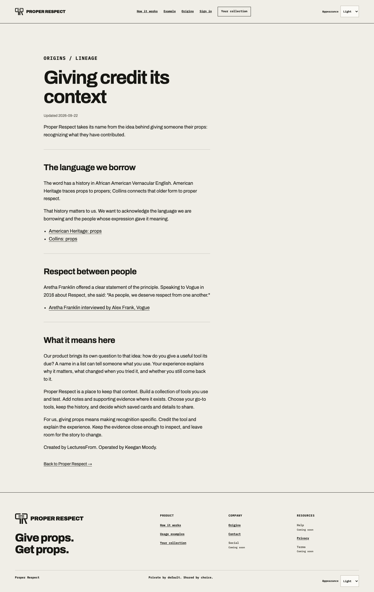
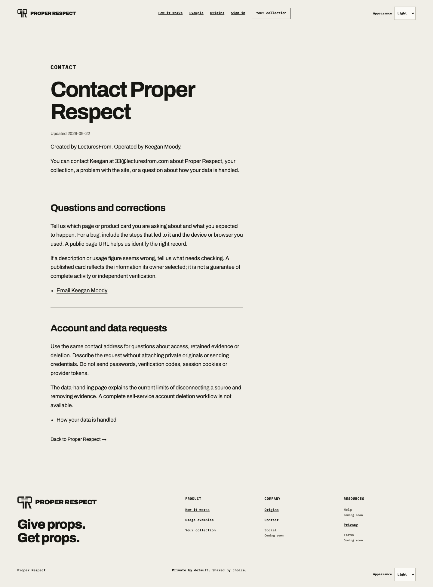
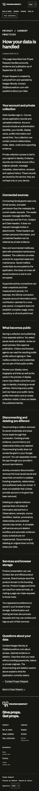

# Factual trust pages — September 22, 2026

Implementation reviewed and tested: `504d5d8724acc05ac5ce6ee2e134d7190a49fb8b`.
Base: `32a851f18632af984e56ab2d761ebc47be870340`.
Ref: https://plan.ref.tools/d6fedvHQMy4bpEJW, Task 7.

## Delivered behavior

`/about/origins`, `/about/contact` and `/about/privacy` now have substantive HTML and matching Markdown twins. One small document model supplies both representations. The footer and agent entry documents link the pages; configured-origin canonicals, Markdown alternates, authored sitemap dates and preview noindex are covered. Root profile handles remain available, including `about`, `contact` and `privacy`.

The contact page identifies Keegan Moody as operator and `33@lecturesfrom.com` as the support contact. Following owner confirmation, ContactPage/Organization metadata identifies LecturesFrom as the business, with country `US`. No registered legal name, incorporation type, street address, price or rating is inferred.

Origins uses attributed definitions from [American Heritage](https://ahdictionary.com/word/search.html?q=props) and [Collins](https://www.collinsdictionary.com/dictionary/english/props), and a short verified quotation from [Vogue's Aretha Franklin interview](https://www.vogue.com/article/aretha-franklin-interview-carole-king). The owner's original draft remains in the Ref; the proposed public narrative omits unsupported historical claims and song lyrics.

The privacy page describes implemented behavior: Clerk sign-in, Convex storage, Gmail permission and requested metadata, private/public separation, local disconnect versus provider revocation, retained evidence/history, external presentation resources and browser storage. It explicitly states that full self-service account deletion and automatic evidence expiry are not implemented. This factual description does not establish legal-policy completeness.

## Verification

- Regression reproduced before implementation: the contact route returned 404.
- `npm test`: 762 Vitest tests passed, two optional tests skipped; seven Node script tests passed.
- `npm run lint`, `npm run typecheck`, and synthetic production build passed.
- Focused development Playwright checks: 30 passed across trust pages, site frame and discovery.
- Built production fixture: nine trust-page browser tests passed, including 12 axe checks across three pages, 320/1440 px and light/dark themes.
- Separately built preview fixture: three GET/HEAD parity and noindex checks passed. The maintained preview configuration is included in CI.
- Independent review of the full implementation found no blocking factual, routing, projection or metadata findings. Reviewer independently checked the final clean tree and diff; broad test counts above came from implementation logs.
- Parent browser walkthrough followed Origins → footer Contact → Privacy in the actual in-app browser. Desktop Origins and 320 px dark Privacy were visually inspected. Text, heading wrapping, navigation and focus were readable; theme and viewport overrides were restored.

All application runs used synthetic or explicitly fixture-only configuration. They did not establish new-user login, two-user isolation, connector lifecycle or legal compliance. No backend, Clerk/OAuth, DNS, merge or production deployment occurred in this slice. Current production remains the earlier 66/C release; these pages have not earned measured Ora credit.

## Screenshots

## Remaining release decisions

The owner confirmed LecturesFrom is the business and the country is the United States. Formal legal-policy commitments remain separate from these identity facts. Review the proposed Origins wording. After an authorized merge/release, check the actual hosted routes and indexing headers, preserve root-profile behavior and request a complete Ora scan. Nested routes intentionally avoid root-handle collisions; scanner acceptance is not presumed.

PStack applied **Model the Domain** to share HTML/Markdown facts without inventing organization data, **Prove It Works** through HTTP/browser evidence, and **Sequence Work into Verifiable Units** to keep this page slice separate from the local MCP prototype and production release.

## PR 48 native navigation correction

Reviewed PR head `38e929d523b2bf7132a2ffa01e551805eb23724f`. The application verification job passed, but [Native Chrome WebMCP run 35738390929](https://github.com/keeganmoody33/PROPER-RESPECT/actions/runs/35738390929/job/106781428466) passed seven checks and failed the eighth. Chrome installed and executed successfully. The lifecycle test still waited for the removed placeholder heading, `Where it comes from.`, after navigating to Origins. This is a stale assertion from the trust-page change, not a browser download failure or evidence of a registration regression.

Disposition: **fix now**. Update only that heading expectation to `Giving credit its context`. Keep the same-document sentinel, empty registration list, stale-handle rejection, return navigation and single-tool remount assertions intact.

The matching test, `Next Link navigation unregisters old native handles and remounts exactly one tool`, passed against real Chrome with `WebMCPTesting,DevToolsWebMCPSupport` enabled. The temporary local configuration preserved the maintained native suite's behavior and used fixture-only development port 8838 to avoid other running checks. Command: `npx playwright test --config playwright.native-trust.local.ts --grep 'Next Link navigation'`. Result: one passed. The temporary configuration was removed afterward. No additional application changes or broad test rerun were needed.

At inspection, the PR had no inline review threads, issue comments or Copilot review. Cursor's automated approval preceded the native failure and is not treated as evidence that all checks passed. The correction requires fresh CI at its new head; the earlier failure is retained here.

## Copilot follow-up

The next inspection found two Copilot comments. The heading finding was already fixed by `e3e652fbdf597f8a5d113605a9f3ebee1cf18334`, whose five hosted checks passed. The second correctly identified duplicated Markdown response headers. Trust pages now call the existing `markdownResponse` helper and add only their preview indexing header to that response. No shared API or route behavior changed. Thirteen focused trust/public-site tests, ESLint and typecheck passed; existing browser/preview CI covers the same response contract. Both findings are addressed in code; final-head CI remains independently required.

## Owner-confirmed business and country

The owner's September 22 clarification was: “US is country. lecturesfrom is the business”. Origins, Contact and Privacy now state those facts in their shared HTML/Markdown source. ContactPage's main entity is Organization/LecturesFrom, with a customer-support ContactPoint and PostalAddress containing only addressCountry US. The fields follow [Organization](https://schema.org/Organization) and [PostalAddress](https://schema.org/PostalAddress); they do not assert an LLC, incorporation, state or street address. Four focused rendered browser checks passed for HTML/Markdown parity and contact metadata; ESLint and typecheck passed. Earlier screenshots precede this copy-only clarification. This update is prepared in the PR; it is not a deployment or measured score change.
