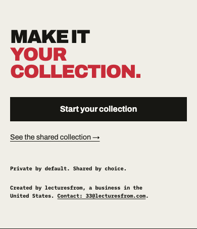
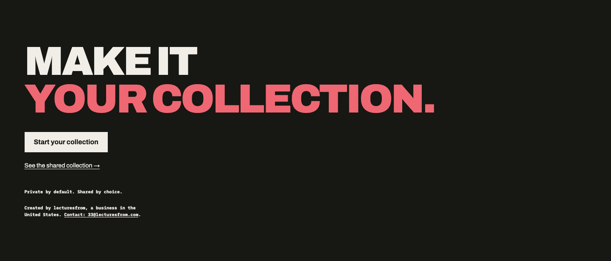

# Creator business identity, 2026-09-23

Proper Respect's homepage now links its SoftwareApplication identity to lecturesfrom, the creator business already described on Contact. A shared inline Organization carries the existing lowercase name, US country and public email, with a stable configuration-derived `/about/contact#organization` ID. Contact uses the same identity. The app retains its type, description, category, operating system, canonical URL and repository link.

A short attribution after the closing homepage action group links to Contact. Homepage Markdown repeats the same facts before Links. No official social profiles, legal name, street address, ratings, pricing, person identity or new capability is asserted. There is no graph wrapper or new module/dependency. The existing import direction from trust-pages to agent-discovery is preserved.

Base: `7743b6dcdfc0590b633bb8c35b3ab81005a61ad8`. Branch: `codex/creator-business-identity-20260923`. Exact commit and patch ID are recorded in the coordinator handoff `/tmp/u15-creator-identity-report.md` after commit. This source retains its existing `/lecturesfrom` links. A selective frontend release must separately preserve the current live `/keegan` links and exclude gated backend changes.

## Dated content

`homepageUpdatedAt` changes from September21 to September23 because the visible homepage and its Markdown gain attribution today. The sitemap expectation changes with it; a built HTTP read confirms the actual value. Contact/Origins/Privacy `updatedAt` dates remain September22 because their factual document prose and practices are unchanged. Contact's new shared entity identifier disambiguates existing metadata; it is not a newly verified business fact. No blanket date refresh occurs.

## Verification

- RED: two new behavior tests fail on the original source. A production baseline on port8864 returned200 and confirmed the homepage/Markdown lacked the attribution while Contact already had it.
- Six focused Vitest suites passed26tests. The later date-only edit passed all10public-site/sitemap tests. `npm run lint`, `npm run typecheck`, and production webpack build passed.
- Existing gated discovery, trust-page and negotiation suites passed34checks against the actual built server. Two new viewport cases verify visible text, Contact navigation, Markdown parity and absence of horizontal overflow. Existing identity assertions remain strict and now compare the full creator/contact object.
- A separate preview production build passed6focused browser/HTTP cases covering noindex on homepage/trust representations, root negotiation, canonical URL and actual sitemap date. The final production build then passed the two affected identity/sitemap browser checks.
- The standalone HTTP verifier under `/tmp/u15-identity-evidence-20260923/verify-identity.mjs` accepts explicit request origin, canonical origin, source path, source SHA and expected public-profile path. It checks the local Git identity, records tracked dirty state and does not claim HTTP can attest a remote deployment SHA. Its expected values do not derive from the implementation helper. A deliberately wrong canonical origin fails6assertions. The final built source passes18/18standalone assertions. Existing release145checks remain separate and unchanged.
- Actual Chromium CTA checks at1440px/390px in light/dark passed, with no horizontal overflow and zero scoped WCAG2A/AA axe violations. Mobile-light and desktop-dark screenshots were inspected; all four captures are retained locally. The first custom visual driver used browser.newPage(), which axe rejected; switching the driver to browser.newContext().newPage() produced the passing checks. No product change was needed.
- Root's independent in-flight no-comments review found no added narration, suppressions or comment findings. Final additions also contain no code comments. Final exact-head review and CI remain separate gates.

## Visual proof

These synthetic public homepage captures contain no account/session data.

## Limits

All application tests used a local build with synthetic reference data, Clerk/backend configuration blank and canonical origin `https://public.example`. Private-route checks verify unchanged error/noindex behavior under that blank configuration; Clerk's missing-provider errors do not establish hosted authentication or two-user acceptance. No live account/provider read, backend sync, deployment, publication, force rescan or new agent capability occurred. No Ora score increase is promised. Independent design reviews preferred inline reuse over a graph because existing consumers can read the creator directly.

The main test evidence is under `/tmp/u15-identity-evidence-20260923`; reproduction instructions are in its README. U13 public observations and primary references remain in `/tmp/u13-ora-metadata-audit.md`. Final source review, selective-artifact proof and hosted verification are coordinator-owned gates.
