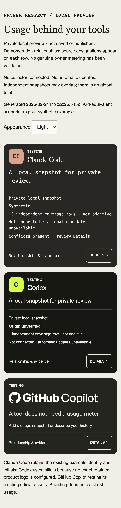
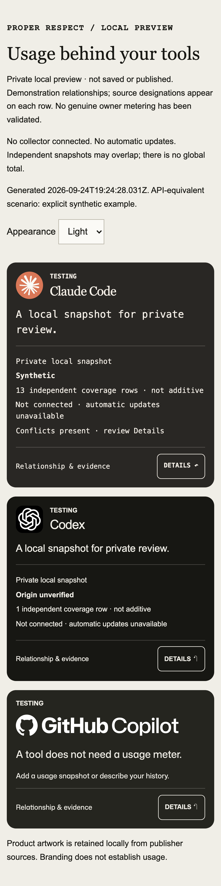
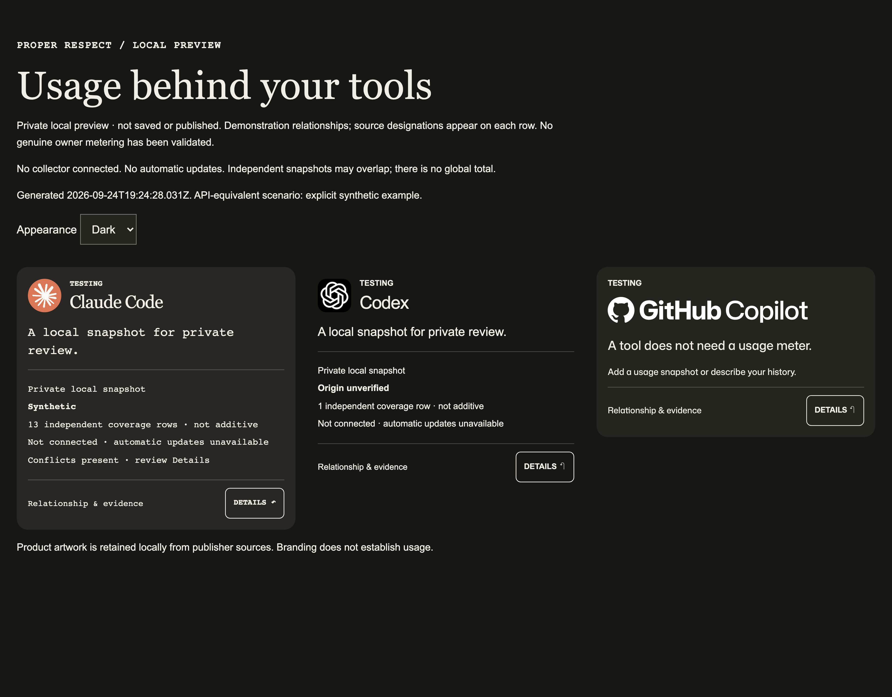

# Known-product usage card logos

Date: 2026-09-24. Base: `708717e9334ac4c9257fa292a9640f01a22aa9ea`.
Branch: `codex/usage-card-logo-baseline-20260924`.
Feature Ref: https://plan.ref.tools/zV1STTK6SxNJva7k

Claude Code and Codex previously resolved no registry image and displayed initials.
The standalone generator packaged only Copilot assets. Both products now use dated
publisher originals through exact slug/domain matching. Codex uses the white
Blossom supplied by its OpenAI editor listing, with a dark surface; this is not
claimed to be a distinct terminal glyph. PNG bytes are unchanged. Source URLs,
retrieval timestamps, dimensions and SHA256 hashes are retained in
`public/product-assets/2026-09-24-product-icons.json`.

The preview copies the selected usage icons and retains Copilot logos, fonts,
license and manifest. Local asset paths are checked before output creation.
Existing output remains protected by directory creation and exclusive writes.
Unknown products and actual failed images retain initials fallback.

## Verification evidence

Raw logs: `/tmp/proper-respect-logo-baseline-20260924/`.

- RED registry: two missing-image failures; RED card: two missing-image failures;
  RED packaging: three missing-file failures. Commands were `npx vitest run`
  with the respective `src/domain/product-icons.test.ts`,
  `src/client/product-card.test.ts`, `src/local/private-usage-preview.test.ts`.
- Focused GREEN: those three files, 81 tests passed.
- Browser baseline: 8 passed. New known-image assertion failed on missing Claude
  image. GREEN: 10 passed, Chromium at 390/1280 widths, light/dark, 3× density.
  Command: `./node_modules/.bin/playwright test private-usage-card.spec.ts --config=/tmp/logo-playwright.config.cjs --output=/tmp/logo-browser-after-20260924`.
  The temporary config uses this repo's Playwright package, test directory,
  one worker, and deviceScaleFactor 3; the spec also sets 3× explicitly.
- Native-only preview uses its own HTTP origin, preventing mixed-preview assets
  from concealing missing native packaging. Both known images decode, dimensions
  cover rendered size at 3×, Codex has a dark surface, aborted images fall back,
  no external requests occur, and keyboard disclosure/no-overflow checks pass.
- `npm test`: first run timed out in unchanged scheduled 200-page mailbox test
  while other checks ran. Complete rerun without build contention exited 0:
  1280 Vitest tests passed, 2 skipped; 7 Node tests passed.
- `npm run lint` and `npm run typecheck`: exit 0.
- Initial unconfigured build compiled but failed static generation because
  PUBLIC_SITE_ORIGIN was unset. Build uses the checked-in workflow's synthetic
  public origin, Convex URL and Clerk publishable key for the configured check;
  configured `npm run build` exited 0.

## Visual evidence

Before and after screenshots are retained in the sibling
`2026-09-24-usage-card-logo-baseline/` directory for all four viewport/theme pairs.

Local synthetic preview: http://127.0.0.1:58256/ (ephemeral server).
Generated at 2026-09-24T19:25:42.351Z from checked-in native Claude and Codex
synthetic fixtures. No other preview server was replaced.

## Review dispositions and boundaries

Independent exact-head review, hosted CI and merge receipt are recorded in the
feature Ref and `/tmp/proper-respect-logo-baseline-20260924/receipt.md` after the
commit is created. No review findings have been received at this checkpoint.

This verifies local synthetic presentation. It does not verify owner metering,
genuine acquisition, hosted ingestion, production rendering, or deployment.
No owner data/configuration/account reads, provider API acquisition, telemetry,
collection, backend synchronization, publication or deployment occurred.
