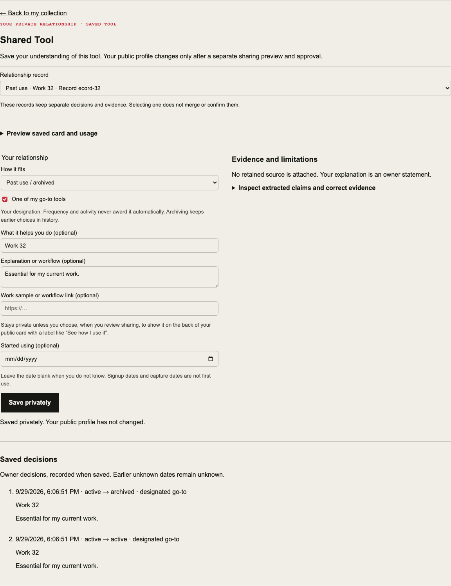
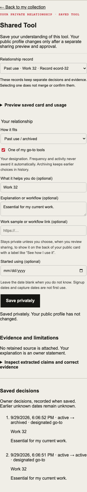

# Owner collection loop

Verified locally 2026-09-29. Base: v0.2.2 / `a1b2174c88240acb2f361d5f8aa78ec2aeca8e4d`.
Branch: `codex/owner-collection-loop`.
Approved product milestone: https://plan.ref.tools/MIJEC6cMSon2xDh5.

## Delivered behavior

The collection has a bounded relationship finder and an exact-record editor.
Search and filtered views traverse lightweight owner-only pages beyond the first
25 records. Incomplete results are labelled until exhaustion; no evidence or
history is hydrated by the locator. Matching records remain separate, including
multiple relationships with the same product. Each has a link that survives
reload. Adding a product opens the returned relationship ID.

The focused editor reuses existing status, explicit go-to, explanation, start
date, work link, evidence inspection, limitations, claim reviews and saved
decisions. Past use is a status view; saved decisions are recorded-time history.
A lazy saved-card preview keeps usage and account-link inspection accessible
inside the focused relationship. An uncertain discovery can be left undecided
without saving. Existing retained
imports, source controls, sharing previews and data export remain available.

No schema, release infrastructure, provider connector or public projection was
changed. Private saves retain their existing optimistic-version, replay and
ownership checks. New queries must be released before the new frontend.

## Verification

- RED: the two new `convex/inventory.test.ts` cases failed because `inventory:locator`
  and `inventory:detail` did not exist.
- GREEN: `npx vitest run convex/inventory.test.ts`: 10 passed. Includes later-page
  lookup, a 25-record maximum per page, multiple records, foreign-owner denial,
  invalid IDs, new authenticated-session reload and unchanged public snapshot.
- Node 24.21.0 `npm test`: 1,660 Vitest tests passed, 2 skipped; 121 Node script tests passed.
- `npm run typecheck`, `npm run lint`: passed.
- Node 24 production `npm run build`, using the workflow's synthetic public
  environment values: passed. No backend deployment ran.
- Component browser suite: 49 passed, including actual owner-collection components
  exercised at 1280px and 390px through a synthetic Convex boundary. The journeys
  cover immediate manual-add opening, later-page finding, duplicate switching,
  private save, reload, history, past-use filtering and unchanged publication.
- After adding the lazy saved-card preview, the 11 affected account/owner-loop
  browser scenarios passed again, together with typecheck and lint.
- Existing inventory browser scenarios: 9 passed during this batch.
- Browser test data is synthetic. Browser reload uses local fixture persistence;
  the fresh authenticated session and ownership checks use convex-test. Neither
  substitutes for the owner's hosted acceptance below.

## Owner acceptance on lecturesfrom after release

Open `/app/collection` while signed in as the owner. Do not publish as part of
these private exercises. Choose the real products yourself.

1. **Current go-to:** find the tool (use All if needed), open the right record,
   choose Currently use, check One of my go-to tools, and explain why it matters.
   Save privately. Reload, then find it under Go-to. Open its bookmarked URL in
   a fresh signed-in session and check the same decisions.
2. **Actively testing:** find it or Add a product. Addition must immediately open
   its relationship with your entered note. Choose Testing now, describe the
   experiment, save, and find it under Testing. Do not designate go-to unless
   that is actually your choice.
3. **Historically important:** choose Past use / archived. Explain when and why
   it mattered and what changed. Leave unknown exact dates blank. Save and find
   it under Past use. Saved decisions should show when you recorded the change,
   not claim that this was the date you stopped using it.
4. **Uncertain discovery:** choose Discoveries or All, open the candidate and
   inspect Evidence and limitations and extracted claims. If you are unsure,
   use Leave it as an undecided discovery; it must stay unconfirmed. Only choose
   and save a relationship when you can actually make that assertion.

For one product with multiple records, switch Relationship record and verify
that each keeps its own explanation and evidence. After a private save, open
`/lecturesfrom` separately and confirm the previously approved public content
has not changed. Repeat the key interaction on a phone-sized screen.

Record where you could not find a tool, distinguish records, understand a claim,
or describe your actual relationship. Those observations define the next
milestone; importance scores and historical intervals are not prerequisites here.

## Release boundary

v0.2.2 remains the known-good production/rollback checkpoint. No tag, merge,
production deploy, provider read, seed, recurring collection or publication was
performed by this implementation receipt. Use the existing owner-gated release
workflow after review. No data migration is required. Preserve the v0.2.2 tag
and frontend artifact; never restore old data to roll back this UI.

## Final outside review

Copilot review 5359748269, head `ab0d6eb7a13753e79082b6d2440faa58fb81fb7d`: comment 4139362094 is **fix now**. The parent onboarding query still collected and enriched all relationships before rendering the bounded finder. Split shell reads from paginated sharing-card reads; bound brand preparation to loaded records and preserve publication identity across pages. No schema change.

The shell regression failed before the fix because `includeCards` was unsupported; it passes with an empty card projection and bounded sharing pages. Nineteen inventory/publication tests pass, including explicit and legacy publication identity across page boundaries. All 49 component browser tests passed; the 11 owner/account journeys passed again with explicit 25-to-34 sharing pagination assertions. Typecheck, lint and production build passed. One full-suite run concurrent with the build hit the existing mailbox test's five-second timeout; verification was repeated sequentially.

Sequential full verification passed: 1,664 Vitest tests (2 skipped) and 121 Node script tests.

Copilot review 5359808285 at `dde5a7e1d16413f9586d5161cde5af12d5b06aae` cleared the parent-read blocker and raised comment 4139413990: **fix now**, read the newest 25 links in the bounded sharing query so revision 26 retains its primary destination. Extend the existing 26-publication regression to sharing.
