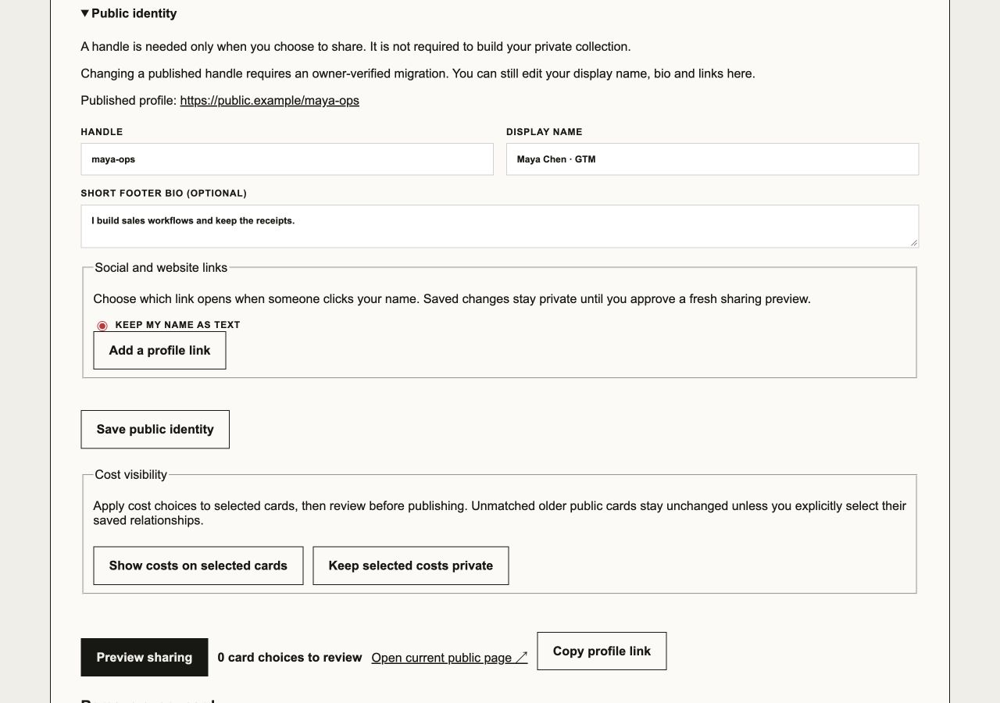
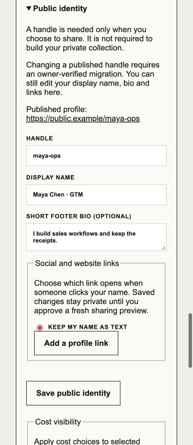

# Onboarding identity iteration · October 8, 2026

Branch: `codex/onboarding-identity-20261008`.
Base: `6cf026b11499854b53f8aaae01f9a133df7578dd`.
Ref: https://plan.ref.tools/Ln459iX6fvAnTGXt
Issue: https://github.com/keeganmoody33/PROPER-RESPECT/issues/159, linked to release-gaps issue #24.

## Behavior

A published owner sees the established handle as read-only, the public URL and the existing rename restriction before submitting. Display name, bio and links remain editable. Save records a draft and requires an approved sharing preview before public changes.

Known unpublished owners can edit their handle. Unknown publication state blocks identity submission with an explanation. Explicit publication takes precedence over a missing or false claimed-identity flag. The existing sharing-preview gate is unchanged.

This changes the existing form, not the brand identity or backend handle policy. The current P/R mark and GTA fist bump are unchanged. Product-card typography, composition and telemetry are later exploration units, not selected design-system rules.

## Review dispositions before implementation

- Fix now: the initial inline candidate required the claimed-identity flag even when publication was positively known. Use publication-first precedence, as independently proposed by candidates B/C and the judge.
- Fix now: replace the ambiguous saved-identity receipt with explicit draft language.
- Deferred: extracting the entire form or introducing a two-function domain API. One existing caller and three simple derived states do not justify either new interface in this pass.
- Not adopted: unsupported contact-us guidance. Describe the existing owner-verified migration restriction without inventing a user-facing migration workflow.
- Deferred: graph controls, product-card arrangements and typography selection. They remain separate exploration units under the owner's gradual-pivot request.

Three inherited-model design candidates and an inherited-model cross-judge considered inline rendering, an owned form component and a pure view model. Candidate scores were A 8/10, B 9/10 and C 8/10. The judge recommended A with B/C's precedence rule. The resulting inline change avoids moving the form and preserves existing submission ownership. This is same-model independent review, not cross-provider validation.

## Failing before

The first attempted run used an obsolete initial heading from the original checkout. It failed before reaching the behavior and is not RED evidence. The test was corrected to the current main-branch heading before implementation.

Command under Node 24.21.0:

```sh
node node_modules/@playwright/test/cli.js test --config tests/e2e/components.config.ts tests/e2e/account-setup.spec.ts --grep 'published handle stays fixed|unknown publication state' --workers=1
```

The corrected run failed all three focused checks. At 1280 px and 390 px, `expect(locator).not.toBeEditable()` received `editable` for the published handle. The third check could not find the unavailable-status explanation. No production code had changed before this run.

The local browser fixture also allowed typing `maya-renamed` into the published `maya-ops` handle before the fix. The fixture models the UI boundary, not the server's rejection. Existing backend tests cover the rejection and unchanged approved identity.

## Passing after

- The initial three focused browser checks passed.
- Expanded `account-setup.spec.ts`: 34 tests passed in 15.1 seconds. This includes six published-handle cases across 1280/390 px and claimed true/false/missing, forged input ignored, Enter submission once, name/bio/link persistence, unknown publication, editable claimed/unclaimed drafts, and the existing private first-result-to-preview journey.
- `vitest run convex/publicationHandles.test.ts src/domain/onboarding.test.ts`: 64 tests passed in 482 ms.
- `tsc --noEmit`: exit 0.
- Scoped ESLint for the component and browser test: exit 0.
- `git diff --check`: exit 0.

The browser fixture uses fictional data and blocks external requests. It proves UI behavior and local fixture persistence. It does not prove live Clerk authentication, hosted persistence, provider collection or deployment. No backend sync, real account creation, provider read or public profile publication occurred.

## Runtime

Dependencies were installed in the new worktree with `npm ci --ignore-scripts`. The shell default was Node 22 and emitted an engine warning during installation. Validation used the official registry's Node 24.21.0 executable. The install reported six high-severity dependency advisories; dependency remediation is outside this UI change. Vitest emitted its existing future native-config-loader warning.

## Independent review and browser proof

The final independent agent reviewed the implementation, tests, receipt and decision trail against this run's transcript. Verdict: No flags. The no-comments pass found zero added or changed comments and zero deletion recommendations. It did not rerun output-producing commands. This was inherited-model independent review, not cross-provider validation.

The in-app browser reproduced the editable published handle before the fix. After rebuilding, the same surface exposed the handle as read-only and saved a display-name edit with the draft receipt. Captures at 1280 × 900 and 390 × 900 are retained as `identity-desktop-2026-10-08.png` and `identity-mobile-2026-10-08.png` in the dated design artifact directory. The mobile document width was 390 px at a 390 px viewport.





## Delivery pass

On October 8, after the owner asked for the last merge and was told this fix remained local, the owner asked to fix that delivery gap. The PR includes the same implementation plus the retained screenshots. The base was refreshed and remains `6cf026b11499854b53f8aaae01f9a133df7578dd`; no rebase was needed. Current-head CI and outside review are recorded in the PR. Production deployment is outside this pass.

## Recurrence

The app confirmed creation of active heartbeat `proper-respect-onboarding-lab`, every four hours in the current chat. The next pass is a visual study of first-card-to-profile presentation. The initial create attempt was rejected for missing a destination; the corrected request explicitly used the current thread and succeeded. The separate delivery automation remains paused.
