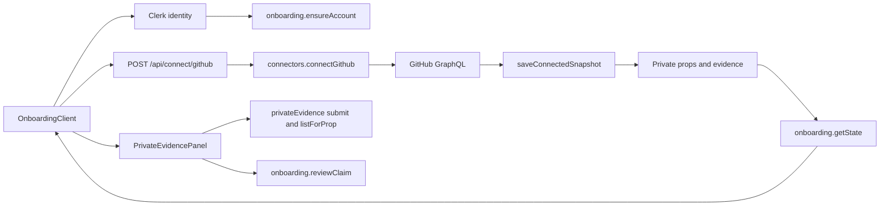
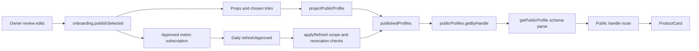
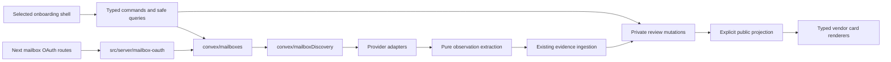

# Connect discovery, private review, and public cards

Created 2026-09-16. Architecture investigation and proposed integration design. No mailbox implementation or shell selection is made by this document.

The [shared contract](https://plan.ref.tools/oUl8LCIQb32SAicK) owns Tasks 1 through 4. My recommendation is to retain the Next.js, Clerk, and Convex application, add account-specific mailbox collection, and adapt one selected prototype to its reviewed data. Keep the prototypes as runnable design evidence. Their React state is not a replacement for the evidence database.

## Read this against the right checkout

Production source references below are relative to the machine-local implementation checkout `/Users/keeganmoody/Downloads/PROPER-RESPECT-self-test-20260916`, at HEAD `4d2171badc0cd9ea310a2c5a615a9313085ccde4` plus dirty files. [The architecture source snapshot](checks/architecture-source-snapshot-2026-09-16.json) captures the actual bytes read. The prototype checkout starts at `4bc8cc81d90be9c5520cae4675573da5bce70e09`; its older root application is not the integration baseline. Do not merge this old root over the newer implementation.

The implementation task owns its uncommitted Task 1 repair. This checkpoint commits only `PRODUCT.md` and this prototype directory. `/Users/keeganmoody/Downloads/PROPER-RESPECT` remains protected. Nothing here authorizes changing, committing, stashing, or resetting that checkout.

## Source statements

The current contract states:

> Repair evidence ingestion so two mailboxes remain separate sources while contributing to one private product draft. **Status: local implementation; not deployed.**

> Implement account-specific authorization, bounded discovery, refresh, and disconnect. **Status: not implemented; depends on Task 1.**

> Build two functional visual alternatives using Taste and DesignSystem with synthetic data. **Status: two local prototypes delivered and checked; neither selected or integrated.**

> Integrate the working mailbox connector with the selected prototype direction and persistent introducer credit. **Status: not implemented; follows Tasks 2 and 3.**

Source: [shared implementation contract](https://plan.ref.tools/oUl8LCIQb32SAicK), read 2026-09-16. The local mirror is `docs/plans/2026-09-16-multiple-mailboxes-and-native-cards.md` in the implementation checkout.

## Current call paths

These diagrams identify inspected symbols. Dashed mailbox components in the later design are proposals; the current diagrams contain existing application paths.



The GitHub route retrieves the signed-in Clerk user's linked GitHub OAuth token and a Convex JWT, then invokes the authenticated action. This is the existing GitHub path, not a Gmail consent mechanism. `connectGithub` fetches activity and encrypts the credential before `saveConnectedSnapshot` persists it. The private query explicitly projects connector fields without `secretRef` or ciphertext. `PrivateEvidencePanel` separately loads and reviews observations; `includeClaims: false` in the main query does not mean claim review is absent.

Source anchors: [GitHub route](/Users/keeganmoody/Downloads/PROPER-RESPECT-self-test-20260916/app/api/connect/github/route.ts:5), [collector](/Users/keeganmoody/Downloads/PROPER-RESPECT-self-test-20260916/convex/connectors.ts:400), [private query](/Users/keeganmoody/Downloads/PROPER-RESPECT-self-test-20260916/convex/onboarding.ts:97), [observation panel](/Users/keeganmoody/Downloads/PROPER-RESPECT-self-test-20260916/components/private-evidence-panel.tsx:355).



The public projection contains this exact filter:

```ts
if (prop.visibility !== "PUBLIC") return [];
```

Source: [projectPublicProfile](/Users/keeganmoody/Downloads/PROPER-RESPECT-self-test-20260916/src/domain/public-profile.ts:182). Publication constructs a stored public profile. The public page reads that projection, not raw mailbox records. Existing approved metric refresh checks the metric, attribution scope, revoked subscription, connector, and public prop before updating the projection. Official product-knowledge refresh is a separate job and must remain distinct from personal usage collection.

Sources: [publication](/Users/keeganmoody/Downloads/PROPER-RESPECT-self-test-20260916/convex/onboarding.ts:451), [refresh guard](/Users/keeganmoody/Downloads/PROPER-RESPECT-self-test-20260916/convex/connectors.ts:515), [jobs](/Users/keeganmoody/Downloads/PROPER-RESPECT-self-test-20260916/convex/crons.ts:1), [public reader](/Users/keeganmoody/Downloads/PROPER-RESPECT-self-test-20260916/src/data/get-public-profile.ts:11).

## Proposed caller experience

These interfaces are design sketches, not existing exported APIs. Derive implementation types from the final validators and Convex IDs rather than copying these sketches into an independent type system.

```ts
// Clerk identity supplies the owner on the server. The browser never supplies userId.
const start = await beginMailboxConnection({ provider: "GOOGLE" });
window.location.assign(start.authorizationUrl);

// Queries return safe connection and scan status, never provider credentials.
const workspace = useQuery(api.mailboxes.workspace);
await startMailboxScan({ connectionId, expectedGeneration });
await savePrivateReview({ propId, expectedRevision, review });
await setMetricRefresh({ propId, connectorId, enabled: false });
await publishReviewedSelection({ propIds, expectedRevision });
await disconnectMailbox({ connectionId });
```

Starting a scan returns a job identity promptly. Account progress and partial results arrive through queries. Saving review does not publish. Publication reads persisted owner decisions and approved evidence references rather than trusting arbitrary activity values in a browser payload. Unchecking refresh is an explicit persisted revocation.

## Ownership and types

| Owner | Data and rules it owns | Boundary |
| --- | --- | --- |
| Clerk and `authHelpers` | Sign-in identity and authenticated owner lookup | Authentication does not grant mailbox read access. A work mailbox is not the person's only recovery method. |
| Proposed `mailboxes` | Provider account identity, consent, connection generation, credential reference, disconnect | Unique owner + provider + verified provider account key. Email is a mutable display label. Credentials stay server-side. |
| Proposed OAuth adapter | Expiring one-use state, callback validation, token exchange, grant checks | Bind state to owner and initiating browser, use fixed registered redirects and supported PKCE, consume state once. Never accept owner identity from callback query text. |
| Proposed `mailboxDiscovery` | Bounded jobs, cursor, retry, extraction version, persistence authorization | Check active connection generation inside the same transaction that persists a batch and advances its cursor. |
| Existing evidence domain | Retained capture, source record identity, observation excerpts, product candidates | Same product across accounts can merge; original evidence and account identity do not merge. |
| Private review domain | Relationship, observation verdicts, introducer, chosen destinations, draft decision | Reopening or rescanning must not reset an owner decision. New source observations remain separately reviewable. |
| Public projection | Explicitly selected fields and approved activity | Whitelist public fields. Raw mail, account labels, credentials, and unapproved observations stay private. |
| Native card components | Render real typed activity and dates with vendor styles | No fetching, identity resolution, provenance inference, or synthetic fallback inside the renderer. |

Use separate connection and scan state. A connected account can have a failed scan without losing consent. Proposed variants:

```ts
type ConnectionState =
  | { kind: "connected"; generation: number; credentialRef: SecretId }
  | { kind: "needsReauth"; generation: number; reason: ReauthReason }
  | { kind: "disconnected"; generation: number; disconnectedAt: string };

type ScanState =
  | { kind: "idle" }
  | { kind: "running"; jobId: JobId; generation: number; checkpoint: ScanCheckpoint }
  | { kind: "complete"; completedAt: string; checkpoint: ScanCheckpoint }
  | { kind: "failed"; code: ScanError; retryAt?: string; checkpoint: ScanCheckpoint };

type IntroducerCredit = {
  raw: string;
  platformChoice:
    | { kind: "suggested" }
    | { kind: "selected"; platform: string }
    | { kind: "omitted" };
  sourceLink?: HttpUrl;
  attestation: "OWNER_REPORTED";
};
```

`SecretId`, `JobId`, `ScanCheckpoint`, `HttpUrl`, and error types are schematic names for schema-derived or boundary-parsed types. Put an OAuth attempt in its own short-lived record because provider account identity is unknown before callback verification. Put scan progress in a job record. Do not turn connection state into a dozen interacting booleans.

Preserve introducer text exactly as entered. A local hostname suggestion can remain derived; explicit selection and explicit omission must persist. A bare handle stays unresolved. A pasted URL can be a separate safe HTTP(S) link, never proof of the person's identity, introduction, or endorsement. Canonical product, affiliate/referral, and introducer links have separate roles through storage and public projection. An explicit owner review controls whether credit appears publicly.

## Proposed module dependencies



Routes translate protocol inputs. Provider adapters parse external responses. Pure domain functions classify observations without network or UI dependencies. Convex mutations own writes and their access checks. Components receive safe view models and emit commands. Keep Primer styles scoped inside GitHub cards. Share review and connection components across the prototypes only where they express the same behavior; selecting a shell remains a user decision.

## One mailbox operation, both directions

1. The owner selects Gmail. The backend creates an owner-bound OAuth attempt. Cancellation returns a per-attempt result and does not create a connected account.
2. A validated callback exchanges the code, checks actual grants and verified provider identity, and stores credentials under that account. A second Gmail account gets a second row. Reconnection rotates the same account's credentials and increments its generation.
3. A bounded worker fetches a page. It records source message identity, retained evidence, observation time, capture time, and extraction version. An email mention is a candidate; billing is cost evidence; neither becomes product use automatically.
4. Persistence verifies owner, account, generation, and job lease before inserting the batch. Retries preserve previous evidence and review. Cursor advancement and batch writes commit together. A disconnect increments the generation and invalidates already-running work before it can persist.
5. Queries expose private candidates with source provenance, safe account labels, progress, and failures. The chosen shell renders what exists even if another account fails.
6. Keeping a product saves private relationship and review decisions. Publishing later projects only chosen cards, approved evidence-derived activity, opted-in credit, and permitted cost fields.
7. The public route reads the stored projection. A renderer shows actual collector fields. Unsupported GitHub commit/PR/repository rows are absent until their own sources exist.
8. Disconnect stops collection while retained reviewed history follows the disclosed policy. Evidence deletion is a separate operation with an explicit cascade through observations, proofs, reviews, drafts, activity, and public projection. A provider failure does not set a relationship to Archived.

## Alternatives considered

| Design | Benefit | Cost or failure | Judgment |
| --- | --- | --- | --- |
| Put the prototype state and fetch calls inside the existing large onboarding component | Fast first rendering | Couples consent, discovery, review, and publication; private decisions disappear on reload; repeats security rules in UI | Reject as production architecture. Keep it for synthetic design comparison. |
| Extend the existing Next/Convex app with mailbox-owned lifecycle and a thin UI adapter | Reuses authentication, evidence, review, subscriptions, and public projection | Requires explicit private-save API, account identity, and migration work | Recommended for this scope. |
| Build a separate discovery service and database with events back into Convex | Independent workers and scaling | Adds a second owner/auth model, delivery retries, reconciliation, and deployment before measured need | Defer until bounded jobs exceed measured runtime or throughput limits. |

Within the recommended design, use dedicated mailbox account/secret/job tables initially, as the master contract proposes. Extending the existing `connectorAccounts` and `connectorSecrets` in place is viable only with a deliberate migration of their one-account-per-provider assumptions. Do not globally rewrite working GitHub/Devin behavior just to add Gmail. Share small crypto/provider utilities when their contracts actually match.

## Concrete integration gaps found in source

1. `saveConnectedSnapshot` looks up credentials with `by_user_provider` and `.unique()`. That cannot store two same-provider credentials independently. Mailbox identity must be finer than provider identity. [Source](/Users/keeganmoody/Downloads/PROPER-RESPECT-self-test-20260916/convex/connectors.ts:253).
2. `publishSelected` contains `activity: selection.publish ? selection.activity : undefined`. It is not a safe private-save command for the prototype's Keep action. Add private review persistence without erasing captured activity or changing publication. [Source](/Users/keeganmoody/Downloads/PROPER-RESPECT-self-test-20260916/convex/onboarding.ts:475).
3. The inspected publication branch creates or updates a subscription only when `selection.autoRefresh` is true. There is no corresponding false branch revoking an existing subscription. Treat turning refresh off as an explicit mutation and verify it after reload. [Source](/Users/keeganmoody/Downloads/PROPER-RESPECT-self-test-20260916/convex/onboarding.ts:509). This is a source finding, not a reproduced live failure.
4. The new ingestion entry point still takes `handle` and resolves the user by handle. Bind mailbox jobs to immutable owner IDs server-side so a profile rename cannot redirect or strand an in-flight job. Preserve the old internal API for callers until migrated. [Source](/Users/keeganmoody/Downloads/PROPER-RESPECT-self-test-20260916/convex/discovery.ts:75).
5. Evidence source validators include `GMAIL`, but no distinct Microsoft/Outlook source. Add the chosen source type consistently through schema, validators, domain unions, proof mapping, and tests. Do not label Microsoft evidence as Gmail. [Source](/Users/keeganmoody/Downloads/PROPER-RESPECT-self-test-20260916/convex/discovery.ts:13).
6. Relationship values are `ACTIVE`, `TESTING`, and `ARCHIVED`. Decide whether the prototype's Tried means currently testing or tried in the past before mapping it. Credit fields and review persistence also need schema, query, validation, projection, and reload coverage.
7. Account-level discovery cadence and approved public metric refresh are different permissions. The existing cron is daily; prototype Manual/Daily/Weekly choices do not create jobs. New candidates and broader metrics remain private pending review.
8. Existing ingestion rejects changed payload or observations under the same identity. A revised extractor must create an explicitly versioned capture linked to the original message, rather than overwrite original observations or retry an identity collision forever.

## Provider facts to preserve

Google's documentation states:

> The OAuth client must prevent CSRF

It also defines offline access, actual granted scopes, registered redirect matching, and account selection. Use a provider library and validate these boundaries in the application. [Google web-server OAuth](https://developers.google.com/identity/protocols/oauth2/web-server), retrieved 2026-09-16.

Microsoft's message reference states:

> By default, this value changes when the item is moved from one container

The account-scoped deduplication design therefore needs stable message IDs, including `Prefer: IdType="ImmutableId"` for the Graph reads that participate in the same identity contract. [Microsoft message resource](https://learn.microsoft.com/en-us/graph/api/resources/message?view=graph-rest-1.0), retrieved 2026-09-16. Test message moves and duplicate pages, not only repeated identical responses.

Provider registration, scopes, consent eligibility, refresh-token handling, secret key configuration and rotation, tenant restrictions, retention/deletion policy, and a real authorized account test are release dependencies. This investigation did not inspect secrets, configure providers, or connect a mailbox. The master contract carries the Gmail restricted-scope release dependency.

## Acceptance evidence for integration

Use the existing contract's Task 1 tests as the prerequisite checkpoint. The following are proposed integration checks, not results:

- Two Gmail accounts plus one Microsoft account retain separate credentials/cursors and one shared product with attributable evidence. Changing an account label leaves identity unchanged.
- Callback replay, partial grants, expired consent, cross-owner mutation, owner handle rename, duplicate pages, provider message moves, concurrent scans, throttling, and disconnect-during-write have deterministic outcomes. Record per-account job identity and error code without logging tokens or message bodies.
- Saving, editing, and reloading private review preserves raw introducer text, platform omission/override, all link roles, relationship, observation verdicts, and activity. Private saves never publish.
- Repeated publication is idempotent for selections and link state. Turning refresh off persists and prevents subsequent writes. A refresh cannot re-enable an opted-out metric or broaden its attribution.
- Public output excludes unselected cards, raw mail, account addresses, private cost, and unapproved observations. New private evidence does not silently replace published activity. Deletion recomputes affected public output according to the disclosed policy.
- Both desktop/mobile keyboard paths remain usable on the integrated Next route. Verify the private-to-public flow there; standalone prototype checks cannot establish production readiness.

## Checkpoint and continuation

Commit the standalone prototypes, their existing verification evidence, this architecture, and the integration handoff. Capture the exact resulting SHA in the shared Ref and fresh task prompt. Do not push or deploy as part of this checkpoint.

The next task should first read this document and the shared contract, verify checkout ancestry and the dirty-source hashes, and identify the smallest next implementation slice. Task 1's implementation owner must checkpoint its own repair before another task builds on those bytes. Task 2 account lifecycle can proceed independently of A/B selection; Task 4 shell integration needs that choice and the relationship meaning resolved. These are distinct decision boundaries, not reasons to redo the prototypes.

Checkpoint verification on 2026-09-16: the prototype build passed again; the latest introducer check passed its 14 interpretation cases, both shells at 1242/390 px, and four axe scans with zero violations, runtime errors, external requests, or checked overflow. The latest tested source hashes still match. Earlier full-flow, independent-review, and Lighthouse evidence remains explicitly tied to its recorded revision. Production tests were not rerun by this task. No application behavior changed during this architecture pass.
